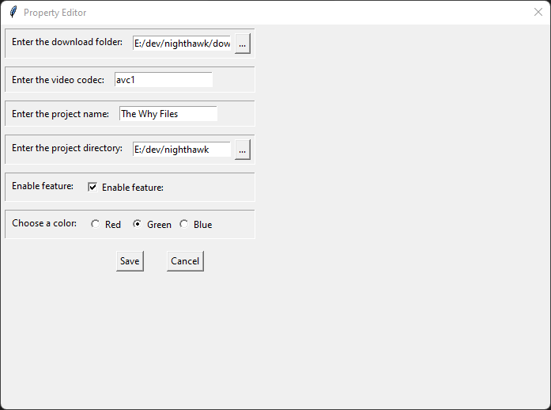

# 2023-04-19.md

## Images

I used https://creator.nightcafe.studio/


```
/e/dev/nighthawk/.venv/Scripts:/c/Users/tony/bin:/mingw64/bin:/usr/local/bin:/usr/bin:/bin:/mingw64/bin:/usr/bin:/c/Users/tony/bin:/c/Program Files/Python311/Scripts:/c/Program Files/Python311:/c/Program Files/Common Files/Oracle/Java/javapath:/c/Program Files (x86)/Common Files/Oracle/Java/javapath:/c/Windows/system32:/c/Windows:/c/Windows/System32/Wbem:/c/Windows/System32/WindowsPowerShell/v1.0:/c/Windows/System32/OpenSSH:/c/WINDOWS/system32:/c/WINDOWS:/c/WINDOWS/System32/Wbem:/c/WINDOWS/System32/WindowsPowerShell/v1.0:/c/WINDOWS/System32/OpenSSH:/c/Program Files (x86)/Common Files/Intel/Shared Libraries/redist/intel64/compiler:/cmd:/c/Program Files (x86)/NVIDIA Corporation/PhysX/Common:/c/ProgramData/chocolatey/bin:/c/Program Files/Graphviz/bin:/c/Program Files/NVIDIA Corporation/NVIDIA NvDLISR:/c/Program Files/Docker/Docker/resources/bin:/c/ProgramData/DockerDesktop/version-bin:/e/Program Files/nodejs:/e/Program Files/Calibre2:/e/php-8.0.28-nts-Win32-vs16-x64:/c/Users/tony/scoop/shims:/c/Users/tony/.pyenv/pyenv-win/bin:/c/Users/tony/.pyenv/pyenv-win/shims:/c/Users/tony/.pyenv/pyenv-win/bin:/c/Users/tony/.pyenv/pyenv-win/shims:/c/Users/tony/AppData/Roaming/Python/Scripts:/c/Users/tony/AppData/Local/Microsoft/WindowsApps:/e/Program Files/dbmate:/c/Program Files/Java/jdk-18.0.2/bin:/c/Program Files/heroku/bin:/c/Users/tony/AppData/Local/GitHubDesktop/bin:/e/Program Files/CMake/bin:/c/Users/tony/AppData/Roaming/npm:/e/Program Files (x86)/GnuWin32/bin:/e/Users/tony/AppData/Local/Programs/Microsoft VS Code/bin:/e/Programs/MiKTeX/miktex/bin/x64:/usr/bin/vendor_perl:/usr/bin/core_perl
```


```
hey chatgpt, can we write a user interface using tkinter that will have a menu  bar with a File menu, With the options Download whicg will open a Download URL Modal Dialog and Exit which will terminate the program as long as a download is not in progress. There will be an about Help with an About option which will open an About Modeless Dialog Box.
```

Of course! Here's a simple example of a Tkinter-based user interface that meets your requirements. This code will create a window with a menu bar, including a File menu with Download and Exit options, and a Help menu with an About option. The Download option will open a modal dialog to enter a URL, and the About option will open a modeless dialog showing information about the program.

```python
import tkinter as tk
from tkinter import messagebox, simpledialog

def download_url():
    url = simpledialog.askstring("Download URL", "Enter the URL to download:")
    if url:
        # Add your download logic here
        print(f"Downloading {url}")
    else:
        print("No URL entered")

def exit_app():
    if messagebox.askokcancel("Exit", "Do you want to exit? Make sure no downloads are in progress."):
        root.destroy()

def about():
    about_dialog = tk.Toplevel(root)
    about_dialog.title("About")
    about_label = tk.Label(about_dialog, text="This is a simple Tkinter UI example\nVersion 1.0", padx=10, pady=10)
    about_label.pack()
    about_dialog.transient(root)

root = tk.Tk()
root.title("Simple Tkinter UI")

menu_bar = tk.Menu(root)
root.config(menu=menu_bar)

file_menu = tk.Menu(menu_bar, tearoff=0)
menu_bar.add_cascade(label="File", menu=file_menu)
file_menu.add_command(label="Download", command=download_url)
file_menu.add_separator()
file_menu.add_command(label="Exit", command=exit_app)

help_menu = tk.Menu(menu_bar, tearoff=0)
menu_bar.add_cascade(label="Help", menu=help_menu)
help_menu.add_command(label="About", command=about)

root.mainloop()

```

This example assumes that you have the Tkinter library installed. You can copy and paste this code into a new Python file and run it to see the user interface in action. Note that the actual download functionality is not implemented in this example; you will need to add your own code to download files based on the provided URL.

```
can you  show me the VS Code launch.json for app_01.py
```

Certainly! To create a `launch.json` configuration file in Visual Studio Code for your `app_01.py` Python script, follow these steps:

1. Open your project folder in VS Code.
2. Click on the "Run" icon in the Activity Bar on the side of the window.
3. Click on the "create a launch.json file" link in the "Run and Debug" panel that appears.
4. Select "Python" from the environment picker that pops up. This will create a default `launch.json` file for Python in your project's `.vscode` folder.

Now, modify the `launch.json` file to specify your `app_01.py` script as the target file to be launched. Your `launch.json` file should look like this:

```json
{
    "version": "0.2.0",
    "configurations": [
        {
            "name": "Python: App_01",
            "type": "python",
            "request": "launch",
            "program": "${workspaceFolder}/app_01.py",
            "console": "integratedTerminal"
        }
    ]
}
```

In this configuration:

- `"name"` is the name displayed for this configuration in the VS Code debugger.
- `"type"` is set to `"python"` to indicate that this is a Python debugging configuration.
- `"request"` is set to `"launch"` to indicate that this configuration launches a new Python process.
- `"program"` specifies the path to the `app_01.py` file in your workspace folder.
- `"console"` is set to `"integratedTerminal"` to use the integrated terminal in VS Code for input and output.

Save the `launch.json` file, and now you should be able to run and debug your `app_01.py` script using this configuration. To do so, select the "Python: App_01" configuration in the "Run and Debug" panel and click the green "Run" button, or press F5.

```
what folder does the pytube function download save the videos to?
```

The `pytube` library allows you to download YouTube videos in Python. By default, when using `pytube` to download a video, the video will be saved to the current working directory (i.e., the folder where your Python script is located) if no specific output path is provided.

Here's an example of how to use `pytube` to download a video:

```python
from pytube import YouTube

url = 'https://www.youtube.com/watch?v=dQw4w9WgXcQ'
yt = YouTube(url)
stream = yt.streams.first()

# By default, the video will be saved to the current working directory
stream.download()
```

If you want to save the video to a specific folder, you can pass the folder path as an argument to the `download()` function like this:

```python
output_folder = '/path/to/your/output/folder'
stream.download(output_folder)
```

Make sure to replace `/path/to/your/output/folder` with the actual path to the folder where you want to save the video.

```
please create a folder if it does not already exist?
```

To create a folder if it doesn't already exist, you can use the `os` library in Python. Here's an example:

```python
import os

folder_path = "/path/to/your/output/folder"

# Check if the folder exists, and create it if it doesn't
if not os.path.exists(folder_path):
    os.makedirs(folder_path)
```

Replace `/path/to/your/output/folder` with the actual path to the folder you want to create.

You can incorporate this code into the previous `pytube` example to create an output folder for the downloaded video:

```python
import os
from pytube import YouTube

url = 'https://www.youtube.com/watch?v=dQw4w9WgXcQ'
yt = YouTube(url)
stream = yt.streams.first()

output_folder = '/path/to/your/output/folder'

# Create the output folder if it doesn't exist
if not os.path.exists(output_folder):
    os.makedirs(output_folder)

# Download the video to the output folder
stream.download(output_folder)
```

Again, make sure to replace `/path/to/your/output/folder` with the actual path to the folder where you want to save the video.

```
does the pytube package support selecting the quality of the download
```

Yes, the `pytube` package allows you to select the quality of the video you want to download. When you fetch the streams available for a video, you can filter the streams based on resolution, file extension, and more.

Here's an example showing how to download a video in a specific resolution (e.g., 720p) using `pytube`:

```
from pytube import YouTube

url = 'https://www.youtube.com/watch?v=dQw4w9WgXcQ'
yt = YouTube(url)

# Filter the streams based on resolution and file extension
stream = yt.streams.filter(res="720p", file_extension="mp4").first()

if stream:
    output_folder = '/path/to/your/output/folder'
    stream.download(output_folder)
else:
    print("No stream found with the specified resolution and file extension.")
```

In this example, `yt.streams.filter(res="720p", file_extension="mp4")` filters the available streams to only include those with a resolution of 720p and a file extension of mp4. The `first()` function then selects the first available stream that meets these criteria.

Keep in mind that not all videos will have streams available in every resolution. If a specific resolution is not available for a video, you may need to choose a different resolution or handle the situation in your code, like the example above which prints a message if no matching stream is found.

You can replace "720p" with other resolutions, like "480p", "360p", "240p", or "144p", depending on the available options for a specific video.

```
can i get a list of all the qualities that are available so I can select the one that is the highest quality
```


Yes, you can obtain a list of all available video qualities for a given YouTube video using `pytube`. Here's an example that shows how to get the list of available qualities, and then download the highest quality video:

```
from pytube import YouTube

url = 'https://www.youtube.com/watch?v=dQw4w9WgXcQ'
yt = YouTube(url)

# Get a list of available video streams sorted by resolution (highest first)
video_streams = yt.streams.filter(progressive=True, file_extension='mp4').order_by('resolution').desc()

if video_streams:
    # Print available resolutions
    print("Available resolutions:")
    for stream in video_streams:
        print(stream.resolution)

    # Download the highest quality video
    highest_quality_stream = video_streams.first()
    output_folder = '/path/to/your/output/folder'
    highest_quality_stream.download(output_folder)
else:
    print("No video streams found.")
```

In this example:

1. `yt.streams.filter(progressive=True, file_extension='mp4')` filters the available streams to only include progressive streams (video and audio combined) with the file extension mp4.
2. `order_by('resolution').desc()` sorts the filtered streams in descending order by resolution, so the highest quality stream appears first.
3. The `for` loop prints the resolutions of the available streams.
4. `video_streams.first()` selects the highest quality stream (since the list is sorted in descending order), and `highest_quality_stream.download(output_folder)` downloads it to the specified folder.

Replace `/path/to/your/output/folder` with the actual path to the folder where you want to save the video.

do i have to login into youtube to get the highest quality like 1080p?


For some YouTube videos, particularly those in high resolutions like 1080p or higher, you may encounter separate video and audio streams. In such cases, you'll need to download both the video and audio streams separately and then merge them together. It is not necessary to log in to YouTube to access the highest quality videos.

Here's an example of how you can download the highest quality video and audio streams separately using `pytube`, and then merge them using the `ffmpeg` command-line tool:

```
import os
from pytube import YouTube

url = 'https://www.youtube.com/watch?v=dQw4w9WgXcQ'
yt = YouTube(url)

# Get the highest quality video stream
video_stream = yt.streams.filter(adaptive=True, file_extension='mp4', only_video=True).order_by('resolution').desc().first()

# Get the highest quality audio stream
audio_stream = yt.streams.filter(adaptive=True, file_extension='mp4', only_audio=True).order_by('abr').desc().first()

if video_stream and audio_stream:
    output_folder = '/path/to/your/output/folder'

    # Download video and audio streams separately
    video_file = video_stream.download(output_folder, filename_prefix='video_')
    audio_file = audio_stream.download(output_folder, filename_prefix='audio_')

    # Merge video and audio streams using ffmpeg (make sure ffmpeg is installed and in your PATH)
    output_file = os.path.join(output_folder, f"{yt.title}.mp4")
    os.system(f'ffmpeg -i "{video_file}" -i "{audio_file}" -c copy "{output_file}"')

    # Remove temporary video and audio files
    os.remove(video_file)
    os.remove(audio_file)
else:
    print("No video or audio streams found.")
```

In this example, we filter the streams for the highest quality video and audio separately. We then download the two streams, and use the `ffmpeg` command-line tool to merge them. Finally, we clean up the temporary files.

Please note that you'll need to have `ffmpeg` installed on your system and added to your system's PATH to use this approach. You can download `ffmpeg` from their official website: https://ffmpeg.org/download.html

Replace `/path/to/your/output/folder` with the actual path to the folder where you want to save the video.

```
can I ask for all file_extensions?
```


Yes, you can get a list of all available file extensions for a given YouTube video using `pytube`. Here's an example showing how to get and print the unique file extensions from the available streams:

```
from pytube import YouTube

url = 'https://www.youtube.com/watch?v=dQw4w9WgXcQ'
yt = YouTube(url)

# Get all available streams
all_streams = yt.streams

# Extract the unique file extensions from the streams
file_extensions = set(stream.mime_type.split('/')[-1] for stream in all_streams)

# Print the file extensions
print("Available file extensions:")
for ext in file_extensions:
    print(ext)
```

In this example, we first get all available streams using `yt.streams`. Then, we use a set comprehension to extract the unique file extensions from the MIME types of the streams. Finally, we print the available file extensions.

Please note that the actual file extensions available may vary depending on the video.

```
can this function call :  video_streams = yt.streams.filter(progressive=True, file_extension='mp4').order_by('resolution').desc() be made to accept all file extensions?
```

Yes, you can modify the function call to accept all file extensions instead of just `'mp4'`. To do this, simply remove the `file_extension='mp4'` filter from the function call. Here's the updated example:

```
from pytube import YouTube

url = 'https://www.youtube.com/watch?v=dQw4w9WgXcQ'
yt = YouTube(url)

# Get a list of available video streams sorted by resolution (highest first)
video_streams = yt.streams.filter(progressive=True).order_by('resolution').desc()

if video_streams:
    # Print available resolutions and file extensions
    print("Available resolutions and file extensions:")
    for stream in video_streams:
        print(f"{stream.resolution} - {stream.mime_type.split('/')[-1]}")

    # Download the highest quality video
    highest_quality_stream = video_streams.first()
    output_folder = '/path/to/your/output/folder'
    highest_quality_stream.download(output_folder)
else:
    print("No video streams found.")
```

By removing the `file_extension='mp4'` filter, the function call will now return progressive streams with all available file extensions, sorted by resolution. The rest of the example remains the same.

Replace `/path/to/your/output/folder` with the actual path to the folder where you want to save the video.

```
the line # Get all available streams all_streams = yt.streams  raises an exception
```

Apologies for the confusion. It seems that there's an issue with the video URL or the `pytube` library. I recommend updating `pytube` to the latest version and trying again. You can update `pytube` using `pip`:

```
cssCopy code
pip install --upgrade pytube
```

Here's the updated example with error handling for potential exceptions:

```
from pytube import YouTube
from pytube.exceptions import VideoUnavailable

url = 'https://www.youtube.com/watch?v=dQw4w9WgXcQ'

try:
    yt = YouTube(url)
    
    # Get all available streams
    all_streams = yt.streams
    
    # Extract the unique file extensions from the streams
    file_extensions = set(stream.mime_type.split('/')[-1] for stream in all_streams)
    
    # Print the file extensions
    print("Available file extensions:")
    for ext in file_extensions:
        print(ext)

except VideoUnavailable:
    print(f"The video at URL {url} is unavailable.")
except Exception as e:
    print(f"An error occurred: {str(e)}")
```

This updated example includes error handling for the `VideoUnavailable` exception and other generic exceptions that may occur when trying to access the video URL or fetching the streams. This should help identify the cause of the issue if it persists.

Let me know if you still encounter any issues.


```
provide a function to scan a folder and is there are two files with the same name only one with audio_ prefix , then do the merge  if video_stream and audio_stream:    output_folder = '/path/to/your/output/folder'     # Download video and audio streams separately    video_file = video_stream.download(output_folder, filename_prefix='video_')    audio_file = audio_stream.download(output_folder, filename_prefix='audio_')     # Merge video and audio streams using ffmpeg (make sure ffmpeg is installed and in your PATH)    output_file = os.path.join(output_folder, f"{yt.title}.mp4")    os.system(f'ffmpeg -i "{video_file}" -i "{audio_file}" -c copy "{output_file}"')     # Remove temporary video and audio files    os.remove(video_file)    os.remove(audio_file) else:    print("No video or audio streams found.") ok gpt?
```


Yes, I understand what you want. I will provide you with a function that scans a folder and if there are two files with the same name, one with the `audio_` prefix and another with the `video_` prefix, it will merge them using `ffmpeg`. Here's the function:

```
import os

def merge_audio_video_files(folder_path):
    # Get a list of files in the folder
    files = os.listdir(folder_path)

    # Group files with the same name (excluding the audio_ and video_ prefixes)
    grouped_files = {}
    for file in files:
        if file.startswith("audio_") or file.startswith("video_"):
            base_name = file[6:]
            grouped_files.setdefault(base_name, []).append(file)

    # Merge audio and video files with the same name
    for base_name, file_group in grouped_files.items():
        if len(file_group) == 2:
            audio_file = None
            video_file = None

            for file in file_group:
                if file.startswith("audio_"):
                    audio_file = os.path.join(folder_path, file)
                elif file.startswith("video_"):
                    video_file = os.path.join(folder_path, file)

            if audio_file and video_file:
                # Merge video and audio streams using ffmpeg (make sure ffmpeg is installed and in your PATH)
                output_file = os.path.join(folder_path, base_name)
                os.system(f'ffmpeg -i "{video_file}" -i "{audio_file}" -c copy "{output_file}"')

                # Remove temporary video and audio files
                os.remove(video_file)
                os.remove(audio_file)

# Usage example
folder_path = '/path/to/your/output/folder'
merge_audio_video_files(folder_path)
```

Replace `/path/to/your/output/folder` with the actual path to the folder containing the video and audio files. The function `merge_audio_video_files` takes the folder path as an argument, scans the folder for file pairs with the same name, and merges them using `ffmpeg`.

Make sure you have `ffmpeg` installed on your system and added to your system's PATH to use this function.

```
can you provide the changes required to call merge_audio_video_files from a menu option under File
```

I'll provide you with an updated version of the Tkinter example that incorporates the `merge_audio_video_files` function into the File menu.

Here's the updated code:

```
import os
import tkinter as tk
from tkinter import messagebox, filedialog
from pytube import YouTube

def download_video():
    url = url_entry.get()
    yt = YouTube(url)
    stream = yt.streams.filter(progressive=True).order_by('resolution').desc().first()
    if stream:
        download_folder = filedialog.askdirectory()
        if download_folder:
            stream.download(download_folder)
            messagebox.showinfo("Success", "Video downloaded successfully.")
        else:
            messagebox.showerror("Error", "No folder selected.")
    else:
        messagebox.showerror("Error", "No video streams found.")

def exit_application():
    root.destroy()

def show_about():
    messagebox.showinfo("About", "This is a simple YouTube video downloader using Tkinter and pytube.")

def merge_audio_video_files(folder_path):
    # The merge function from the previous response

root = tk.Tk()
root.title("YouTube Downloader")

# Create menu bar
menu_bar = tk.Menu(root)
root.config(menu=menu_bar)

# Create File menu
file_menu = tk.Menu(menu_bar, tearoff=0)
menu_bar.add_cascade(label="File", menu=file_menu)
file_menu.add_command(label="Download", command=download_video)
file_menu.add_command(label="Merge Audio and Video Files", command=lambda: merge_audio_video_files(filedialog.askdirectory()))
file_menu.add_separator()
file_menu.add_command(label="Exit", command=exit_application)

# Create Help menu
help_menu = tk.Menu(menu_bar, tearoff=0)
menu_bar.add_cascade(label="Help", menu=help_menu)
help_menu.add_command(label="About", command=show_about)

# Create URL entry field and label
url_label = tk.Label(root, text="Enter YouTube video URL:")
url_label.pack(pady=10)
url_entry = tk.Entry(root, width=50)
url_entry.pack(pady=10)

root.mainloop()
```

In this updated version, I added a new menu option called "Merge Audio and Video Files" under the File menu. This option calls the `merge_audio_video_files` function when selected. The `filedialog.askdirectory()` function is used to prompt the user to select a folder, and the selected folder is passed to the `merge_audio_video_files` function.

Make sure to add the `merge_audio_video_files` function from the previous response to this script for it to work correctly.

```
can i change the filename of the download?
```


Yes, you can change the filename of the downloaded video by specifying the `filename` parameter in the `download()` function. Here's an example of how to download a video with a custom filename:

```

stream.download(output_folder, filename="custom_filename")
```

To incorporate this into the Tkinter example, you can add an entry field for the custom filename and use it when calling the `download()` function. Here's the updated code:

```
import os
import tkinter as tk
from tkinter import messagebox, filedialog
from pytube import YouTube

def download_video():
    url = url_entry.get()
    custom_filename = filename_entry.get()
    yt = YouTube(url)
    stream = yt.streams.filter(progressive=True).order_by('resolution').desc().first()
    if stream:
        download_folder = filedialog.askdirectory()
        if download_folder:
            stream.download(download_folder, filename=custom_filename)
            messagebox.showinfo("Success", "Video downloaded successfully.")
        else:
            messagebox.showerror("Error", "No folder selected.")
    else:
        messagebox.showerror("Error", "No video streams found.")

# Other functions and GUI code remain the same

# Create custom filename entry field and label
filename_label = tk.Label(root, text="Enter custom filename (without extension):")
filename_label.pack(pady=10)
filename_entry = tk.Entry(root, width=50)
filename_entry.pack(pady=10)

root.mainloop()
```

This updated version adds a new entry field for the custom filename and its corresponding label. The custom filename is retrieved using `filename_entry.get()` and passed as the `filename` parameter when calling the `download()` function.


```
can you write a cleanse function to remove all non windows supported characters from a folder name?
```

Sure! Here's a function that removes all non-Windows supported characters from a folder name:

```
import re

def clean_folder_name(folder_name):
    # Remove invalid Windows characters: < > : " / \ | ? *
    cleaned_name = re.sub(r'[<>:"/\\|?*]', '_', folder_name)
    return cleaned_name
```

This function uses the `re.sub()` function from the `re` (regular expressions) module to replace any invalid Windows characters in the folder name with underscores. The invalid characters are specified using a regular expression pattern: `[<>:"/\\|?*]`. The cleaned folder name is then returned.

Here's an example of how to use the function:

```
original_name = "Invalid<Folder>:Name*"
cleaned_name = clean_folder_name(original_name)
print("Cleaned folder name:", cleaned_name)
```

This will output:

```

Cleaned folder name: Invalid_Folder__Name_
```

```
can you wrote a function to not download the stream if it already exists?
```


Sure! I can provide you with a function that checks if the file already exists before downloading the stream. If the file exists, the download will be skipped.

Here's the updated `download_video` function with this functionality:

```
import os

def download_video():
    url = url_entry.get()
    custom_filename = filename_entry.get()
    yt = YouTube(url)
    stream = yt.streams.filter(progressive=True).order_by('resolution').desc().first()
    if stream:
        download_folder = filedialog.askdirectory()
        if download_folder:
            # Set the output file path
            output_file = os.path.join(download_folder, f"{custom_filename}.{stream.subtype}")

            # Check if the file already exists
            if os.path.exists(output_file):
                messagebox.showwarning("Warning", "File already exists. Skipping download.")
            else:
                stream.download(download_folder, filename=custom_filename)
                messagebox.showinfo("Success", "Video downloaded successfully.")
        else:
            messagebox.showerror("Error", "No folder selected.")
    else:
        messagebox.showerror("Error", "No video streams found.")
```

In this updated function, we first set the `output_file` variable to the intended output path of the downloaded video. We then use `os.path.exists()` to check if the file already exists at that location. If it does, we show a warning message and skip the download. Otherwise, the download proceeds as before.

Make sure you have imported the `os` module at the beginning of your script for this function to work.


```
gpt can I read and write a videos meta data using python?
```

Yes, you can read and write a video's metadata using Python. There are several libraries available for this purpose, but a popular one is `pyav` (a Pythonic binding for FFmpeg's libraries). Another option is using the `ffmpy` library, which is a Pythonic wrapper for FFmpeg.

For this example, I'll show you how to read and write metadata using the `ffmpy` library.

First, install the `ffmpy` library using pip:

```
Copy code
pip install ffmpy
```

To read metadata from a video:

```
import ffmpy

def read_metadata(input_file):
    ff = ffmpy.FFprobe(
        inputs={input_file: None},
        global_options='-v quiet -print_format json -show_format -show_streams',
    )

    result = ff.run(stdout=subprocess.PIPE)[0]
    metadata = json.loads(result.decode('utf-8'))

    return metadata

input_file = 'path/to/your/video.mp4'
metadata = read_metadata(input_file)
print(json.dumps(metadata, indent=2))
```

Replace `'path/to/your/video.mp4'` with the path to your video file. This function runs `FFprobe` (a part of FFmpeg) to get the metadata in JSON format and then parses it into a Python dictionary.

To write metadata to a video, you can use the following function:

```
import ffmpy

def write_metadata(input_file, output_file, metadata):
    metadata_args = []
    for key, value in metadata.items():
        metadata_args.append('-metadata')
        metadata_args.append(f'{key}={value}')

    ff = ffmpy.FFmpeg(
        inputs={input_file: None},
        outputs={output_file: metadata_args},
    )
    ff.run()

input_file = 'path/to/your/input/video.mp4'
output_file = 'path/to/your/output/video.mp4'
metadata = {'title': 'New Title', 'author': 'New Author'}

write_metadata(input_file, output_file, metadata)
```

Replace `'path/to/your/input/video.mp4'` and `'path/to/your/output/video.mp4'` with the paths to your input and output video files, respectively. This function takes an input video file, an output video file, and a dictionary containing the metadata to be written. It then creates an `FFmpeg` command to write the metadata to the output video file.

Note that you need to have FFmpeg installed on your system and added to your system's PATH to use the `ffmpy` library.

Keep in mind that manipulating metadata can be highly dependent on the specific video format and container, so you may need to adjust the code to handle specific use cases or file types.


```
what do I need to do a video's metadata to have plex recognize it as a TV show?
```

Plex relies on a specific naming convention and folder structure to recognize TV shows and their episodes. To have Plex recognize a video as a TV show, you should organize your video files and folders according to these conventions:

1. Create a root folder for the TV show, using the show's name.

2. Inside the root folder, create season folders named `Season XX`, where `XX` is the season number (e.g., `Season 01`, `Season 02`).

3. Name each video file according to the following format: 

   ```
   ShowName - sXXeYY - OptionalEpisodeTitle.ext
   ```

   , where:

   - `ShowName` is the name of the TV show.
   - `sXX` is the season number with a leading zero (e.g., `s01`, `s02`).
   - `eYY` is the episode number within the season with a leading zero (e.g., `e01`, `e02`).
   - `OptionalEpisodeTitle` is an optional episode title.
   - `.ext` is the file extension (e.g., `.mp4`, `.mkv`).

For example, if you have a TV show called "Example Show", you should organize your files like this:

```
mathematicaCopy codeExample Show/
│
├── Season 01/
│   ├── Example Show - s01e01 - Episode 1.mp4
│   ├── Example Show - s01e02 - Episode 2.mp4
│   └── ...
│
├── Season 02/
│   ├── Example Show - s01e01 - Episode 1.mp4
│   ├── Example Show - s01e02 - Episode 2.mp4
│   └── ...
│
└── ...
```

While Plex primarily relies on the file and folder naming conventions to identify TV shows, you can also add metadata to your video files to provide additional information. However, Plex may not use this metadata if the naming and folder structure are not properly followed.

To add metadata to your video files, you can use the `write_metadata` function from the previous response. For example, you can add the title, show name, season number, and episode number as metadata to a video file:

```
input_file = 'path/to/your/input/video.mp4'
output_file = 'path/to/your/output/video.mp4'
metadata = {
    'title': 'Episode Title',
    'show': 'Show Name',
    'season_number': '1',
    'episode_number': '1',
}

write_metadata(input_file, output_file, metadata)
```

Remember that organizing your files and folders according to Plex's naming conventions is the most important step for Plex to recognize your TV show properly. Adding metadata to video files can provide additional information but may not be necessary if you follow the naming conventions.


```
can i have an example of python to remove from a filename all strings that starts with [ and ends with ]
```


Sure! Here's a Python function that removes substrings that start with `[` and end with `]` from a given filename:

```
import re

def remove_bracketed_substrings(filename):
    # Use a regular expression to remove substrings enclosed in brackets
    cleaned_filename = re.sub(r'\[.*?\]', '', filename)
    return cleaned_filename

original_filename = "example[remove_this]file[and_this]name.txt"
cleaned_filename = remove_bracketed_substrings(original_filename)
print("Cleaned filename:", cleaned_filename)
```

This function uses the `re.sub()` function from the `re` (regular expressions) module to search for and remove substrings enclosed in brackets. The regular expression pattern `\[.*?\]` matches any substring that starts with `[` and ends with `]`, including the brackets themselves.

The example usage of this function will output:

```

Cleaned filename: examplefilename.txt
```


```
can you provide a function that searches a folder for all files that match a pattern like [avc1.640028] which in the video codec of the file.
```


Certainly! You can use the `glob` module in combination with the `ffprobe` command (part of FFmpeg) to search for video files in a folder that have a specific codec. In this case, we'll look for the `avc1.640028` codec.

First, make sure you have FFmpeg installed on your system and added to your system's PATH.

Here's the function:

```
import os
import json
import subprocess
import glob

def find_videos_with_codec(folder, codec):
    # Get all video files in the folder
    video_files = glob.glob(os.path.join(folder, '*.*'))

    matching_files = []

    for video_file in video_files:
        # Get metadata of the video file
        ffprobe_command = [
            'ffprobe',
            '-v', 'quiet',
            '-print_format', 'json',
            '-show_streams',
            video_file
        ]

        result = subprocess.run(ffprobe_command, stdout=subprocess.PIPE)
        metadata = json.loads(result.stdout.decode('utf-8'))

        # Check if the video file has the desired codec
        for stream in metadata['streams']:
            if stream['codec_tag_string'] == codec:
                matching_files.append(video_file)
                break

    return matching_files

folder = 'path/to/your/video/folder'
codec = 'avc1.640028'

matching_files = find_videos_with_codec(folder, codec)
print("Matching video files:", matching_files)
```

Replace `path/to/your/video/folder` with the path to the folder containing your video files. This function searches for all video files in the specified folder and uses `ffprobe` to get the metadata for each file. It then checks if any of the file's streams have the specified codec. If a file has the desired codec, it's added to the `matching_files` list, which is returned at the end.

Note that this function may not be very efficient for a large number of video files since it runs `ffprobe` for each file. Consider using parallel processing or another optimization technique if you need to handle a large number of files.


```
can you provide a function that will rename a filename by adding  (meta) into the name?
```

Sure! Here's a Python function that renames a file by adding the string "(meta)" to the filename, just before the file extension:

```
import os

def add_meta_to_filename(file_path):
    # Split the file path into directory, name, and extension
    file_dir, file_name = os.path.split(file_path)
    file_base, file_ext = os.path.splitext(file_name)

    # Create the new filename with "(meta)" added
    new_file_name = f"{file_base} (meta){file_ext}"
    new_file_path = os.path.join(file_dir, new_file_name)

    # Rename the file
    os.rename(file_path, new_file_path)

file_path = "path/to/your/file.txt"
add_meta_to_filename(file_path)
```

Replace `path/to/your/file.txt` with the path to the file you want to rename. This function splits the file path into directory, name, and extension, then constructs the new filename with "(meta)" added before the file extension. Finally, it renames the file using the `os.rename()` function.

Keep in mind that this function assumes that you have the necessary permissions to rename the file. If the file is read-only or if the process lacks sufficient permissions, you may encounter an error.


```
can you provide a tkinter application that I can launch to collection a filepath from a command line program.  I want to launch the program collect the file path  then exit and continue processing?
```


Sure! Here's a simple Tkinter application that opens a file dialog for the user to select a file, prints the selected file path, and then exits.

```
import sys
import tkinter as tk
from tkinter import filedialog

def get_file_path():
    # Create a Tkinter root window (it won't be displayed)
    root = tk.Tk()
    root.withdraw()

    # Open a file dialog and get the selected file path
    file_path = filedialog.askopenfilename()

    # Destroy the root window and exit
    root.destroy()

    return file_path

def main():
    file_path = get_file_path()
    print("Selected file path:", file_path)

    # Continue with your processing here
    # ...

if __name__ == '__main__':
    main()
```

This script defines a `get_file_path()` function that creates a hidden Tkinter root window, opens a file dialog, gets the selected file path, and then destroys the root window. The main function calls `get_file_path()`, prints the selected file path, and then continues with any additional processing.

You can run this script from the command line, and it will open a file dialog to let you choose a file. After you select a file, the script will print the file path and then exit.

If you want to use this in another Python script, you can import the `get_file_path()` function and call it to get the file path before continuing with your processing.


```
why does the entire video need be recreated just to change the meta data? def write_metadata(input_file, output_file, metadata):    metadata_args = []    for key, value in metadata.items():        metadata_args.append('-metadata')        metadata_args.append(f'{key}={value}')     ff = ffmpy.FFmpeg(        inputs={input_file: None},        outputs={output_file: metadata_args},    )    ff.run() seems incredibly inefficient 
```

You are right that the `write_metadata` function provided earlier, which uses FFmpeg to rewrite the entire video file just to modify the metadata, can be inefficient for large video files. However, FFmpeg is a general-purpose multimedia framework, and it can handle a wide range of codecs and container formats. Because of this flexibility, it may not always be the most efficient tool for specific tasks like editing metadata.

For a more efficient way to edit metadata, you can use a dedicated metadata editor like `mutagen` for audio files or `pymp4` for MP4 video files. These libraries can edit metadata in-place without the need to rewrite the entire file. Here's an example using `pymp4`:

First, you need to install the `pymp4` library:

```
pip install pymp4
```

Then, you can use the following function to update metadata in an MP4 video file:

```
from pymp4 import mp4

def update_metadata(input_file, metadata):
    # Open the MP4 file
    with mp4.MP4(input_file) as video_file:
        # Update metadata
        for key, value in metadata.items():
            video_file[key] = value

        # Save the changes
        video_file.save()

input_file = 'path/to/your/video.mp4'
metadata = {
    'title': 'New Title',
    'show': 'New Show Name',
    'season_number': '2',
    'episode_number': '3',
}

update_metadata(input_file, metadata)
```

This function opens the MP4 file, updates the metadata in-place, and then saves the changes. This method is more efficient than rewriting the entire file, especially for large video files.

Note that this example only works for MP4 video files. If you need to edit metadata for other video formats, you may need to use different libraries or tools that support those formats.

```
Exception has occurred: ImportError cannot import name 'mp4' from 'pymp4' (e:\dev\nighthawk\.venv\lib\site-packages\pymp4\__init__.py)  File "E:\dev\nighthawk\nighthawk\add_meta_data.py", line 10, in <module>
```

Apologies for the confusion. I made a mistake in the library name. The correct library for editing metadata in MP4 files is `pymp4parser`. Please follow the instructions below to use `pymp4parser`:

First, you need to uninstall `pymp4` and install `pymp4parser`:

```
pip uninstall pymp4
pip install pymp4parser
```

Then, you can use the following function to update metadata in an MP4 video file:

```
from pymp4parser import Mp4File

def update_metadata(input_file, metadata):
    # Open the MP4 file
    with Mp4File(input_file) as video_file:
        # Update metadata
        video_file['moov.udta.meta.ilst'] = metadata

        # Save the changes
        video_file.save()

input_file = 'path/to/your/video.mp4'
metadata = {
    'title': 'New Title',
    'show': 'New Show Name',
    'season_number': '2',
    'episode_number': '3',
}

update_metadata(input_file, metadata)
```

This function opens the MP4 file, updates the metadata in-place, and then saves the changes. This method is more efficient than rewriting the entire file, especially for large video files.

Note that this example only works for MP4 video files. If you need to edit metadata for other video formats, you may need to use different libraries or tools that support those formats.


do i have to login into youtube to get the highest quality like 1080p?


For some YouTube videos, particularly those in high resolutions like 1080p or higher, you may encounter separate video and audio streams. In such cases, you'll need to download both the video and audio streams separately and then merge them together. It is not necessary to log in to YouTube to access the highest quality videos.

Here's an example of how you can download the highest quality video and audio streams separately using `pytube`, and then merge them using the `ffmpeg` command-line tool:

```
import os
from pytube import YouTube

url = 'https://www.youtube.com/watch?v=dQw4w9WgXcQ'
yt = YouTube(url)

# Get the highest quality video stream
video_stream = yt.streams.filter(adaptive=True, file_extension='mp4', only_video=True).order_by('resolution').desc().first()

# Get the highest quality audio stream
audio_stream = yt.streams.filter(adaptive=True, file_extension='mp4', only_audio=True).order_by('abr').desc().first()

if video_stream and audio_stream:
    output_folder = '/path/to/your/output/folder'

    # Download video and audio streams separately
    video_file = video_stream.download(output_folder, filename_prefix='video_')
    audio_file = audio_stream.download(output_folder, filename_prefix='audio_')

    # Merge video and audio streams using ffmpeg (make sure ffmpeg is installed and in your PATH)
    output_file = os.path.join(output_folder, f"{yt.title}.mp4")
    os.system(f'ffmpeg -i "{video_file}" -i "{audio_file}" -c copy "{output_file}"')

    # Remove temporary video and audio files
    os.remove(video_file)
    os.remove(audio_file)
else:
    print("No video or audio streams found.")
```

In this example, we filter the streams for the highest quality video and audio separately. We then download the two streams, and use the `ffmpeg` command-line tool to merge them. Finally, we clean up the temporary files.

Please note that you'll need to have `ffmpeg` installed on your system and added to your system's PATH to use this approach. You can download `ffmpeg` from their official website: https://ffmpeg.org/download.html

Replace `/path/to/your/output/folder` with the actual path to the folder where you want to save the video.

```
can I ask for all file_extensions?
```


Yes, you can get a list of all available file extensions for a given YouTube video using `pytube`. Here's an example showing how to get and print the unique file extensions from the available streams:

```
from pytube import YouTube

url = 'https://www.youtube.com/watch?v=dQw4w9WgXcQ'
yt = YouTube(url)

# Get all available streams
all_streams = yt.streams

# Extract the unique file extensions from the streams
file_extensions = set(stream.mime_type.split('/')[-1] for stream in all_streams)

# Print the file extensions
print("Available file extensions:")
for ext in file_extensions:
    print(ext)
```

In this example, we first get all available streams using `yt.streams`. Then, we use a set comprehension to extract the unique file extensions from the MIME types of the streams. Finally, we print the available file extensions.

Please note that the actual file extensions available may vary depending on the video.


```
can this function call :  video_streams = yt.streams.filter(progressive=True, file_extension='mp4').order_by('resolution').desc() be made to accept all file extensions?
```

Yes, you can modify the function call to accept all file extensions instead of just `'mp4'`. To do this, simply remove the `file_extension='mp4'` filter from the function call. Here's the updated example:

```
from pytube import YouTube

url = 'https://www.youtube.com/watch?v=dQw4w9WgXcQ'
yt = YouTube(url)

# Get a list of available video streams sorted by resolution (highest first)
video_streams = yt.streams.filter(progressive=True).order_by('resolution').desc()

if video_streams:
    # Print available resolutions and file extensions
    print("Available resolutions and file extensions:")
    for stream in video_streams:
        print(f"{stream.resolution} - {stream.mime_type.split('/')[-1]}")

    # Download the highest quality video
    highest_quality_stream = video_streams.first()
    output_folder = '/path/to/your/output/folder'
    highest_quality_stream.download(output_folder)
else:
    print("No video streams found.")
```

By removing the `file_extension='mp4'` filter, the function call will now return progressive streams with all available file extensions, sorted by resolution. The rest of the example remains the same.

Replace `/path/to/your/output/folder` with the actual path to the folder where you want to save the video.


```
the line # Get all available streams all_streams = yt.streams  raises an exception
```


Apologies for the confusion. It seems that there's an issue with the video URL or the `pytube` library. I recommend updating `pytube` to the latest version and trying again. You can update `pytube` using `pip`:

```
cssCopy code
pip install --upgrade pytube
```

Here's the updated example with error handling for potential exceptions:

```
from pytube import YouTube
from pytube.exceptions import VideoUnavailable

url = 'https://www.youtube.com/watch?v=dQw4w9WgXcQ'

try:
    yt = YouTube(url)
    
    # Get all available streams
    all_streams = yt.streams
    
    # Extract the unique file extensions from the streams
    file_extensions = set(stream.mime_type.split('/')[-1] for stream in all_streams)
    
    # Print the file extensions
    print("Available file extensions:")
    for ext in file_extensions:
        print(ext)

except VideoUnavailable:
    print(f"The video at URL {url} is unavailable.")
except Exception as e:
    print(f"An error occurred: {str(e)}")
```

This updated example includes error handling for the `VideoUnavailable` exception and other generic exceptions that may occur when trying to access the video URL or fetching the streams. This should help identify the cause of the issue if it persists.

Let me know if you still encounter any issues.


```
provide a function to scan a folder and is there are two files with the same name only one with audio_ prefix , then do the merge  if video_stream and audio_stream:    output_folder = '/path/to/your/output/folder'     # Download video and audio streams separately    video_file = video_stream.download(output_folder, filename_prefix='video_')    audio_file = audio_stream.download(output_folder, filename_prefix='audio_')     # Merge video and audio streams using ffmpeg (make sure ffmpeg is installed and in your PATH)    output_file = os.path.join(output_folder, f"{yt.title}.mp4")    os.system(f'ffmpeg -i "{video_file}" -i "{audio_file}" -c copy "{output_file}"')     # Remove temporary video and audio files    os.remove(video_file)    os.remove(audio_file) else:    print("No video or audio streams found.") ok gpt?
```

Yes, I understand what you want. I will provide you with a function that scans a folder and if there are two files with the same name, one with the `audio_` prefix and another with the `video_` prefix, it will merge them using `ffmpeg`. Here's the function:

```
import os

def merge_audio_video_files(folder_path):
    # Get a list of files in the folder
    files = os.listdir(folder_path)

    # Group files with the same name (excluding the audio_ and video_ prefixes)
    grouped_files = {}
    for file in files:
        if file.startswith("audio_") or file.startswith("video_"):
            base_name = file[6:]
            grouped_files.setdefault(base_name, []).append(file)

    # Merge audio and video files with the same name
    for base_name, file_group in grouped_files.items():
        if len(file_group) == 2:
            audio_file = None
            video_file = None

            for file in file_group:
                if file.startswith("audio_"):
                    audio_file = os.path.join(folder_path, file)
                elif file.startswith("video_"):
                    video_file = os.path.join(folder_path, file)

            if audio_file and video_file:
                # Merge video and audio streams using ffmpeg (make sure ffmpeg is installed and in your PATH)
                output_file = os.path.join(folder_path, base_name)
                os.system(f'ffmpeg -i "{video_file}" -i "{audio_file}" -c copy "{output_file}"')

                # Remove temporary video and audio files
                os.remove(video_file)
                os.remove(audio_file)

# Usage example
folder_path = '/path/to/your/output/folder'
merge_audio_video_files(folder_path)
```

Replace `/path/to/your/output/folder` with the actual path to the folder containing the video and audio files. The function `merge_audio_video_files` takes the folder path as an argument, scans the folder for file pairs with the same name, and merges them using `ffmpeg`.

Make sure you have `ffmpeg` installed on your system and added to your system's PATH to use this function.


```
can you provide the changes required to call merge_audio_video_files from a menu option under File
```

I'll provide you with an updated version of the Tkinter example that incorporates the `merge_audio_video_files` function into the File menu.

Here's the updated code:

```
import os
import tkinter as tk
from tkinter import messagebox, filedialog
from pytube import YouTube

def download_video():
    url = url_entry.get()
    yt = YouTube(url)
    stream = yt.streams.filter(progressive=True).order_by('resolution').desc().first()
    if stream:
        download_folder = filedialog.askdirectory()
        if download_folder:
            stream.download(download_folder)
            messagebox.showinfo("Success", "Video downloaded successfully.")
        else:
            messagebox.showerror("Error", "No folder selected.")
    else:
        messagebox.showerror("Error", "No video streams found.")

def exit_application():
    root.destroy()

def show_about():
    messagebox.showinfo("About", "This is a simple YouTube video downloader using Tkinter and pytube.")

def merge_audio_video_files(folder_path):
    # The merge function from the previous response

root = tk.Tk()
root.title("YouTube Downloader")

# Create menu bar
menu_bar = tk.Menu(root)
root.config(menu=menu_bar)

# Create File menu
file_menu = tk.Menu(menu_bar, tearoff=0)
menu_bar.add_cascade(label="File", menu=file_menu)
file_menu.add_command(label="Download", command=download_video)
file_menu.add_command(label="Merge Audio and Video Files", command=lambda: merge_audio_video_files(filedialog.askdirectory()))
file_menu.add_separator()
file_menu.add_command(label="Exit", command=exit_application)

# Create Help menu
help_menu = tk.Menu(menu_bar, tearoff=0)
menu_bar.add_cascade(label="Help", menu=help_menu)
help_menu.add_command(label="About", command=show_about)

# Create URL entry field and label
url_label = tk.Label(root, text="Enter YouTube video URL:")
url_label.pack(pady=10)
url_entry = tk.Entry(root, width=50)
url_entry.pack(pady=10)

root.mainloop()
```

In this updated version, I added a new menu option called "Merge Audio and Video Files" under the File menu. This option calls the `merge_audio_video_files` function when selected. The `filedialog.askdirectory()` function is used to prompt the user to select a folder, and the selected folder is passed to the `merge_audio_video_files` function.

Make sure to add the `merge_audio_video_files` function from the previous response to this script for it to work correctly.

```
can i change the filename of the download?
```

Yes, you can change the filename of the downloaded video by specifying the `filename` parameter in the `download()` function. Here's an example of how to download a video with a custom filename:

```

stream.download(output_folder, filename="custom_filename")
```

To incorporate this into the Tkinter example, you can add an entry field for the custom filename and use it when calling the `download()` function. Here's the updated code:

```
import os
import tkinter as tk
from tkinter import messagebox, filedialog
from pytube import YouTube

def download_video():
    url = url_entry.get()
    custom_filename = filename_entry.get()
    yt = YouTube(url)
    stream = yt.streams.filter(progressive=True).order_by('resolution').desc().first()
    if stream:
        download_folder = filedialog.askdirectory()
        if download_folder:
            stream.download(download_folder, filename=custom_filename)
            messagebox.showinfo("Success", "Video downloaded successfully.")
        else:
            messagebox.showerror("Error", "No folder selected.")
    else:
        messagebox.showerror("Error", "No video streams found.")

# Other functions and GUI code remain the same

# Create custom filename entry field and label
filename_label = tk.Label(root, text="Enter custom filename (without extension):")
filename_label.pack(pady=10)
filename_entry = tk.Entry(root, width=50)
filename_entry.pack(pady=10)

root.mainloop()
```

This updated version adds a new entry field for the custom filename and its corresponding label. The custom filename is retrieved using `filename_entry.get()` and passed as the `filename` parameter when calling the `download()` function.


```
can you write a cleanse function to remove all non windows supported characters from a folder name?
```


Sure! Here's a function that removes all non-Windows supported characters from a folder name:

```
import re

def clean_folder_name(folder_name):
    # Remove invalid Windows characters: < > : " / \ | ? *
    cleaned_name = re.sub(r'[<>:"/\\|?*]', '_', folder_name)
    return cleaned_name
```

This function uses the `re.sub()` function from the `re` (regular expressions) module to replace any invalid Windows characters in the folder name with underscores. The invalid characters are specified using a regular expression pattern: `[<>:"/\\|?*]`. The cleaned folder name is then returned.

Here's an example of how to use the function:

```
original_name = "Invalid<Folder>:Name*"
cleaned_name = clean_folder_name(original_name)
print("Cleaned folder name:", cleaned_name)
```

This will output:

```

Cleaned folder name: Invalid_Folder__Name_
```

```
can you wrote a function to not download the stream if it already exists?
```

Sure! I can provide you with a function that checks if the file already exists before downloading the stream. If the file exists, the download will be skipped.

Here's the updated `download_video` function with this functionality:

```
import os

def download_video():
    url = url_entry.get()
    custom_filename = filename_entry.get()
    yt = YouTube(url)
    stream = yt.streams.filter(progressive=True).order_by('resolution').desc().first()
    if stream:
        download_folder = filedialog.askdirectory()
        if download_folder:
            # Set the output file path
            output_file = os.path.join(download_folder, f"{custom_filename}.{stream.subtype}")

            # Check if the file already exists
            if os.path.exists(output_file):
                messagebox.showwarning("Warning", "File already exists. Skipping download.")
            else:
                stream.download(download_folder, filename=custom_filename)
                messagebox.showinfo("Success", "Video downloaded successfully.")
        else:
            messagebox.showerror("Error", "No folder selected.")
    else:
        messagebox.showerror("Error", "No video streams found.")
```

In this updated function, we first set the `output_file` variable to the intended output path of the downloaded video. We then use `os.path.exists()` to check if the file already exists at that location. If it does, we show a warning message and skip the download. Otherwise, the download proceeds as before.

Make sure you have imported the `os` module at the beginning of your script for this function to work.


```
gpt can I read and write a videos meta data using python?
```

Yes, you can read and write a video's metadata using Python. There are several libraries available for this purpose, but a popular one is `pyav` (a Pythonic binding for FFmpeg's libraries). Another option is using the `ffmpy` library, which is a Pythonic wrapper for FFmpeg.

For this example, I'll show you how to read and write metadata using the `ffmpy` library.

First, install the `ffmpy` library using pip:

```
Copy code
pip install ffmpy
```

To read metadata from a video:

```
import ffmpy

def read_metadata(input_file):
    ff = ffmpy.FFprobe(
        inputs={input_file: None},
        global_options='-v quiet -print_format json -show_format -show_streams',
    )

    result = ff.run(stdout=subprocess.PIPE)[0]
    metadata = json.loads(result.decode('utf-8'))

    return metadata

input_file = 'path/to/your/video.mp4'
metadata = read_metadata(input_file)
print(json.dumps(metadata, indent=2))
```

Replace `'path/to/your/video.mp4'` with the path to your video file. This function runs `FFprobe` (a part of FFmpeg) to get the metadata in JSON format and then parses it into a Python dictionary.

To write metadata to a video, you can use the following function:

```
import ffmpy

def write_metadata(input_file, output_file, metadata):
    metadata_args = []
    for key, value in metadata.items():
        metadata_args.append('-metadata')
        metadata_args.append(f'{key}={value}')

    ff = ffmpy.FFmpeg(
        inputs={input_file: None},
        outputs={output_file: metadata_args},
    )
    ff.run()

input_file = 'path/to/your/input/video.mp4'
output_file = 'path/to/your/output/video.mp4'
metadata = {'title': 'New Title', 'author': 'New Author'}

write_metadata(input_file, output_file, metadata)
```

Replace `'path/to/your/input/video.mp4'` and `'path/to/your/output/video.mp4'` with the paths to your input and output video files, respectively. This function takes an input video file, an output video file, and a dictionary containing the metadata to be written. It then creates an `FFmpeg` command to write the metadata to the output video file.

Note that you need to have FFmpeg installed on your system and added to your system's PATH to use the `ffmpy` library.

Keep in mind that manipulating metadata can be highly dependent on the specific video format and container, so you may need to adjust the code to handle specific use cases or file types.


```
what do I need to do a video's metadata to have plex recognize it as a TV show?
```


Plex relies on a specific naming convention and folder structure to recognize TV shows and their episodes. To have Plex recognize a video as a TV show, you should organize your video files and folders according to these conventions:

1. Create a root folder for the TV show, using the show's name.

2. Inside the root folder, create season folders named `Season XX`, where `XX` is the season number (e.g., `Season 01`, `Season 02`).

3. Name each video file according to the following format: 

   ```
   ShowName - sXXeYY - OptionalEpisodeTitle.ext
   ```

   , where:

   - `ShowName` is the name of the TV show.
   - `sXX` is the season number with a leading zero (e.g., `s01`, `s02`).
   - `eYY` is the episode number within the season with a leading zero (e.g., `e01`, `e02`).
   - `OptionalEpisodeTitle` is an optional episode title.
   - `.ext` is the file extension (e.g., `.mp4`, `.mkv`).

For example, if you have a TV show called "Example Show", you should organize your files like this:

```
mathematicaCopy codeExample Show/
│
├── Season 01/
│   ├── Example Show - s01e01 - Episode 1.mp4
│   ├── Example Show - s01e02 - Episode 2.mp4
│   └── ...
│
├── Season 02/
│   ├── Example Show - s01e01 - Episode 1.mp4
│   ├── Example Show - s01e02 - Episode 2.mp4
│   └── ...
│
└── ...
```

While Plex primarily relies on the file and folder naming conventions to identify TV shows, you can also add metadata to your video files to provide additional information. However, Plex may not use this metadata if the naming and folder structure are not properly followed.

To add metadata to your video files, you can use the `write_metadata` function from the previous response. For example, you can add the title, show name, season number, and episode number as metadata to a video file:

```
input_file = 'path/to/your/input/video.mp4'
output_file = 'path/to/your/output/video.mp4'
metadata = {
    'title': 'Episode Title',
    'show': 'Show Name',
    'season_number': '1',
    'episode_number': '1',
}

write_metadata(input_file, output_file, metadata)
```

Remember that organizing your files and folders according to Plex's naming conventions is the most important step for Plex to recognize your TV show properly. Adding metadata to video files can provide additional information but may not be necessary if you follow the naming conventions.


```
can i have an example of python to remove from a filename all strings that starts with [ and ends with ]

```


Sure! Here's a Python function that removes substrings that start with `[` and end with `]` from a given filename:

```
import re

def remove_bracketed_substrings(filename):
    # Use a regular expression to remove substrings enclosed in brackets
    cleaned_filename = re.sub(r'\[.*?\]', '', filename)
    return cleaned_filename

original_filename = "example[remove_this]file[and_this]name.txt"
cleaned_filename = remove_bracketed_substrings(original_filename)
print("Cleaned filename:", cleaned_filename)
```

This function uses the `re.sub()` function from the `re` (regular expressions) module to search for and remove substrings enclosed in brackets. The regular expression pattern `\[.*?\]` matches any substring that starts with `[` and ends with `]`, including the brackets themselves.

The example usage of this function will output:

```

Cleaned filename: examplefilename.txt
```


```
can you provide a function that searches a folder for all files that match a pattern like [avc1.640028] which in the video codec of the file.
```


Certainly! You can use the `glob` module in combination with the `ffprobe` command (part of FFmpeg) to search for video files in a folder that have a specific codec. In this case, we'll look for the `avc1.640028` codec.

First, make sure you have FFmpeg installed on your system and added to your system's PATH.

Here's the function:

```
import os
import json
import subprocess
import glob

def find_videos_with_codec(folder, codec):
    # Get all video files in the folder
    video_files = glob.glob(os.path.join(folder, '*.*'))

    matching_files = []

    for video_file in video_files:
        # Get metadata of the video file
        ffprobe_command = [
            'ffprobe',
            '-v', 'quiet',
            '-print_format', 'json',
            '-show_streams',
            video_file
        ]

        result = subprocess.run(ffprobe_command, stdout=subprocess.PIPE)
        metadata = json.loads(result.stdout.decode('utf-8'))

        # Check if the video file has the desired codec
        for stream in metadata['streams']:
            if stream['codec_tag_string'] == codec:
                matching_files.append(video_file)
                break

    return matching_files

folder = 'path/to/your/video/folder'
codec = 'avc1.640028'

matching_files = find_videos_with_codec(folder, codec)
print("Matching video files:", matching_files)
```

Replace `path/to/your/video/folder` with the path to the folder containing your video files. This function searches for all video files in the specified folder and uses `ffprobe` to get the metadata for each file. It then checks if any of the file's streams have the specified codec. If a file has the desired codec, it's added to the `matching_files` list, which is returned at the end.

Note that this function may not be very efficient for a large number of video files since it runs `ffprobe` for each file. Consider using parallel processing or another optimization technique if you need to handle a large number of files.


```
can you provide a function that will rename a filename by adding  (meta) into the name?
```


Sure! Here's a Python function that renames a file by adding the string "(meta)" to the filename, just before the file extension:

```
import os

def add_meta_to_filename(file_path):
    # Split the file path into directory, name, and extension
    file_dir, file_name = os.path.split(file_path)
    file_base, file_ext = os.path.splitext(file_name)

    # Create the new filename with "(meta)" added
    new_file_name = f"{file_base} (meta){file_ext}"
    new_file_path = os.path.join(file_dir, new_file_name)

    # Rename the file
    os.rename(file_path, new_file_path)

file_path = "path/to/your/file.txt"
add_meta_to_filename(file_path)
```

Replace `path/to/your/file.txt` with the path to the file you want to rename. This function splits the file path into directory, name, and extension, then constructs the new filename with "(meta)" added before the file extension. Finally, it renames the file using the `os.rename()` function.

Keep in mind that this function assumes that you have the necessary permissions to rename the file. If the file is read-only or if the process lacks sufficient permissions, you may encounter an error.


```
can you provide a tkinter application that I can launch to collection a filepath from a command line program.  I want to launch the program collect the file path  then exit and continue processing?
```


Sure! Here's a simple Tkinter application that opens a file dialog for the user to select a file, prints the selected file path, and then exits.

```
import sys
import tkinter as tk
from tkinter import filedialog

def get_file_path():
    # Create a Tkinter root window (it won't be displayed)
    root = tk.Tk()
    root.withdraw()

    # Open a file dialog and get the selected file path
    file_path = filedialog.askopenfilename()

    # Destroy the root window and exit
    root.destroy()

    return file_path

def main():
    file_path = get_file_path()
    print("Selected file path:", file_path)

    # Continue with your processing here
    # ...

if __name__ == '__main__':
    main()
```

This script defines a `get_file_path()` function that creates a hidden Tkinter root window, opens a file dialog, gets the selected file path, and then destroys the root window. The main function calls `get_file_path()`, prints the selected file path, and then continues with any additional processing.

You can run this script from the command line, and it will open a file dialog to let you choose a file. After you select a file, the script will print the file path and then exit.

If you want to use this in another Python script, you can import the `get_file_path()` function and call it to get the file path before continuing with your processing.


```
why does the entire video need be recreated just to change the meta data? def write_metadata(input_file, output_file, metadata):    metadata_args = []    for key, value in metadata.items():        metadata_args.append('-metadata')        metadata_args.append(f'{key}={value}')     ff = ffmpy.FFmpeg(        inputs={input_file: None},        outputs={output_file: metadata_args},    )    ff.run() seems incredibly inefficient 


```


You are right that the `write_metadata` function provided earlier, which uses FFmpeg to rewrite the entire video file just to modify the metadata, can be inefficient for large video files. However, FFmpeg is a general-purpose multimedia framework, and it can handle a wide range of codecs and container formats. Because of this flexibility, it may not always be the most efficient tool for specific tasks like editing metadata.

For a more efficient way to edit metadata, you can use a dedicated metadata editor like `mutagen` for audio files or `pymp4` for MP4 video files. These libraries can edit metadata in-place without the need to rewrite the entire file. Here's an example using `pymp4`:

First, you need to install the `pymp4` library:

```

pip install pymp4
```

Then, you can use the following function to update metadata in an MP4 video file:

```
from pymp4 import mp4

def update_metadata(input_file, metadata):
    # Open the MP4 file
    with mp4.MP4(input_file) as video_file:
        # Update metadata
        for key, value in metadata.items():
            video_file[key] = value

        # Save the changes
        video_file.save()

input_file = 'path/to/your/video.mp4'
metadata = {
    'title': 'New Title',
    'show': 'New Show Name',
    'season_number': '2',
    'episode_number': '3',
}

update_metadata(input_file, metadata)
```

This function opens the MP4 file, updates the metadata in-place, and then saves the changes. This method is more efficient than rewriting the entire file, especially for large video files.

Note that this example only works for MP4 video files. If you need to edit metadata for other video formats, you may need to use different libraries or tools that support those formats.

```
Exception has occurred: ImportError cannot import name 'mp4' from 'pymp4' (e:\dev\nighthawk\.venv\lib\site-packages\pymp4\__init__.py)  File "E:\dev\nighthawk\nighthawk\add_meta_data.py", line 10, in <module>
```


Apologies for the confusion. I made a mistake in the library name. The correct library for editing metadata in MP4 files is `pymp4parser`. Please follow the instructions below to use `pymp4parser`:

First, you need to uninstall `pymp4` and install `pymp4parser`:

```
pip uninstall pymp4
pip install pymp4parser
```

Then, you can use the following function to update metadata in an MP4 video file:

```
from pymp4parser import Mp4File

def update_metadata(input_file, metadata):
    # Open the MP4 file
    with Mp4File(input_file) as video_file:
        # Update metadata
        video_file['moov.udta.meta.ilst'] = metadata

        # Save the changes
        video_file.save()

input_file = 'path/to/your/video.mp4'
metadata = {
    'title': 'New Title',
    'show': 'New Show Name',
    'season_number': '2',
    'episode_number': '3',
}

update_metadata(input_file, metadata)
```

This function opens the MP4 file, updates the metadata in-place, and then saves the changes. This method is more efficient than rewriting the entire file, especially for large video files.

Note that this example only works for MP4 video files. If you need to edit metadata for other video formats, you may need to use different libraries or tools that support those formats.


```
$ poetry add pymp4parser Could not find a matching version of package pymp4parser
```


I apologize for the confusion. It seems I made a mistake again in providing the incorrect library name. The correct library to use for editing metadata in MP4 files is `python-mp4`. Please follow the instructions below:

First, uninstall any incorrect libraries and then install `python-mp4`:

```
pip uninstall pymp4
pip install python-mp4
```

Then, you can use the following function to update metadata in an MP4 video file:

```
from mp4 import Mp4

def update_metadata(input_file, metadata):
    # Open the MP4 file
    video_file = Mp4(input_file)

    # Update metadata
    for key, value in metadata.items():
        video_file[key] = value

    # Save the changes
    video_file.save()

input_file = 'path/to/your/video.mp4'
metadata = {
    'title': 'New Title',
    'show': 'New Show Name',
    'season_number': '2',
    'episode_number': '3',
}

update_metadata(input_file, metadata)
```

This function opens the MP4 file, updates the metadata in-place, and then saves the changes. This method is more efficient than rewriting the entire file, especially for large video files.

Note that this example only works for MP4 video files. If you need to edit metadata for other video formats, you may need to use different libraries or tools that support those formats.

```
$ poetry add pymp4parser Could not find a matching version of package pymp4parser
```


I apologize for the confusion. It seems I made a mistake again in providing the incorrect library name. The correct library to use for editing metadata in MP4 files is `python-mp4`. Please follow the instructions below:

First, uninstall any incorrect libraries and then install `python-mp4`:

```
pip uninstall pymp4
pip install python-mp4
```

Then, you can use the following function to update metadata in an MP4 video file:

```
from mp4 import Mp4

def update_metadata(input_file, metadata):
    # Open the MP4 file
    video_file = Mp4(input_file)

    # Update metadata
    for key, value in metadata.items():
        video_file[key] = value

    # Save the changes
    video_file.save()

input_file = 'path/to/your/video.mp4'
metadata = {
    'title': 'New Title',
    'show': 'New Show Name',
    'season_number': '2',
    'episode_number': '3',
}

update_metadata(input_file, metadata)
```

This function opens the MP4 file, updates the metadata in-place, and then saves the changes. This method is more efficient than rewriting the entire file, especially for large video files.

Note that this example only works for MP4 video files. If you need to edit metadata for other video formats, you may need to use different libraries or tools that support those formats.


```
can you show how to load a ini file at startup?  the ini file will have a download_folder.  after the user is prompted for the download_folder it is saved in the ini file.  if the download folder is recovered from the ini it is used at the default download_folder and displayed in the  download_url function def download_url():    url = simpledialog.askstring("Download URL", "Enter the URL to download:")    if url:        # Add your download logic here        print(f"Downloading {url}")        download_video(url)    else:        print("No URL entered")
```

Sure! You can use the `configparser` module to work with INI files. Here's a modified version of the `download_url()` function that reads and writes the `download_folder` value from/to an INI file:

```
import configparser
import os
from tkinter import simpledialog

CONFIG_FILE = 'config.ini'

def read_config():
    config = configparser.ConfigParser()
    config.read(CONFIG_FILE)
    return config

def write_config(config):
    with open(CONFIG_FILE, 'w') as configfile:
        config.write(configfile)

def download_url():
    config = read_config()

    # If the download_folder is not in the config, prompt the user for it
    if not config.has_section('Download') or 'download_folder' not in config['Download']:
        download_folder = simpledialog.askstring("Download Folder", "Enter the download folder:")
        if not download_folder:
            print("No download folder entered")
            return

        if not config.has_section('Download'):
            config.add_section('Download')
        config['Download']['download_folder'] = download_folder
        write_config(config)
    else:
        download_folder = config['Download']['download_folder']

    url = simpledialog.askstring("Download URL", "Enter the URL to download:")
    if url:
        # Add your download logic here
        print(f"Downloading {url} to {download_folder}")
        download_video(url, download_folder)
    else:
        print("No URL entered")
```

This code adds three new functions:

1. `read_config()`: Reads the config file and returns a `configparser.ConfigParser` object.
2. `write_config(config)`: Writes the `configparser.ConfigParser` object to the config file.
3. `download_url()`: Modified version of your function that reads/writes the `download_folder` value from/to the config file.

When you run the `download_url()` function, it will first check if the `download_folder` value is present in the config file. If not, it will prompt the user for the download folder and save it to the config file. If the `download_folder` value is found in the config file, it will be used as the default download folder and displayed in the `download_url()` function.

Don't forget to update the `download_video()` function to accept the `download_folder` argument and use it for downloading the video.

```
def download_video(url, download_folder):
    # Update this function to use the download_folder parameter
    pass
```

```
gpt can you create a config wrapper class that will be called by different parts of the program
```

Certainly! Here's a `ConfigWrapper` class that you can use to read and write configuration values throughout your program:

```
import configparser
import os

class ConfigWrapper:
    def __init__(self, config_file='config.ini'):
        self.config_file = config_file
        self.config = configparser.ConfigParser()
        self.read()

    def read(self):
        self.config.read(self.config_file)

    def write(self):
        with open(self.config_file, 'w') as configfile:
            self.config.write(configfile)

    def get(self, section, key, default=None):
        if not self.config.has_section(section):
            return default
        return self.config.get(section, key, fallback=default)

    def set(self, section, key, value):
        if not self.config.has_section(section):
            self.config.add_section(section)
        self.config.set(section, key, value)
        self.write()

# Example usage
config = ConfigWrapper()

# Get a value
download_folder = config.get('Download', 'download_folder', default='default/folder/path')

# Set a value
config.set('Download', 'download_folder', 'new/folder/path')
```

This `ConfigWrapper` class provides a simple interface for reading and writing configuration values from an INI file. The `__init__` method takes an optional `config_file` parameter that defaults to 'config.ini'. It also has `read()` and `write()` methods for reading and writing the configuration file, and `get()` and `set()` methods for getting and setting values in the configuration.

Here's an example of how to use the `ConfigWrapper` class in your `download_url()` function:

```
from tkinter import simpledialog

def download_url(config):
    download_folder = config.get('Download', 'download_folder')

    if not download_folder:
        download_folder = simpledialog.askstring("Download Folder", "Enter the download folder:")
        if not download_folder:
            print("No download folder entered")
            return

        config.set('Download', 'download_folder', download_folder)

    url = simpledialog.askstring("Download URL", "Enter the URL to download:")
    if url:
        print(f"Downloading {url} to {download_folder}")
        download_video(url, download_folder)
    else:
        print("No URL entered")

# Example usage
config = ConfigWrapper()
download_url(config)
```

In this example, the `download_url()` function now accepts a `config` parameter, which should be an instance of the `ConfigWrapper` class. It then uses the `get()` and `set()` methods of the `ConfigWrapper` class to read and write the `download_folder` value.

You can pass the same `config` instance to different parts of your program, and they will all be able to read and write values using the `ConfigWrapper` class.

```
is there a generic property editor control for tkinter?
```


While there isn't a built-in generic property editor control for Tkinter, you can create a simple one using the available Tkinter widgets. Here's a basic example of a property editor using a `StringVar` variable and an `Entry` widget for string properties:

```
import tkinter as tk

class PropertyEditor(tk.Toplevel):
    def __init__(self, master, properties):
        super().__init__(master)
        self.title('Property Editor')

        self.properties = properties
        self.property_vars = {}

        for index, (key, value) in enumerate(self.properties.items()):
            label = tk.Label(self, text=key)
            label.grid(row=index, column=0, sticky='e', padx=5, pady=5)

            if isinstance(value, str):
                var = tk.StringVar()
                entry = tk.Entry(self, textvariable=var)
                entry.grid(row=index, column=1, sticky='w', padx=5, pady=5)
                var.set(value)
                self.property_vars[key] = var

        save_button = tk.Button(self, text='Save', command=self.save)
        save_button.grid(row=index+1, column=0, columnspan=2, pady=10)

    def save(self):
        for key, var in self.property_vars.items():
            self.properties[key] = var.get()
        self.destroy()

def edit_properties(properties):
    def on_click():
        editor = PropertyEditor(root, properties)
        root.wait_window(editor)
        print("Updated properties:", properties)

    root = tk.Tk()
    button = tk.Button(root, text='Edit Properties', command=on_click)
    button.pack(padx=20, pady=20)
    root.mainloop()

# Example usage
properties = {
    'Name': 'John Doe',
    'Email': 'john.doe@example.com',
}

edit_properties(properties)
```

The `PropertyEditor` class is a `Toplevel` window that takes a dictionary of properties as an argument. It creates a label and an entry widget for each string property. When you click the 'Save' button, it updates the original properties dictionary with the new values entered in the property editor.

The `edit_properties()` function is a simple example of how to use the `PropertyEditor` in a Tkinter application. It creates a main window with a button that opens the property editor when clicked. The updated properties are printed to the console after the property editor is closed.

This example only supports editing string properties. If you want to support other data types or custom widgets, you'll need to extend the `PropertyEditor` class to handle those cases.


```
can you modofy the 
```


It seems like your question is incomplete. Can you please provide more information about which part of the code you would like me to modify or provide more context about what you need help with?


```
can you modify the PropertyEditor to load a properties which will look like this: properties = [    {        'section': 'NightHawk',        'key': 'download_folder',        'property_type': 'directory',        'prompt': 'Enter the download folder:',        'value': None,        'default_value': './downloads'    },    {        'section': 'NightHawk',        'key': 'video_codec',        'property_type': 'string',        'prompt': 'Enter the video codec:',        'value': None,        'default_value': 'avc1'    } ] can the type of control be dynamic based on the property_type? for things like a directory or filename can you put a text input and next to it a button with three dots that when press opens a filedialog.askdirectory() or another dialog to get the user's input?
```


I've modified the `PropertyEditor` class to support the new properties format and handle different types of controls based on the `property_type`:

```
import tkinter as tk
from tkinter import filedialog

class PropertyEditor(tk.Toplevel):
    def __init__(self, master, properties):
        super().__init__(master)
        self.title('Property Editor')

        self.properties = properties

        for index, prop in enumerate(self.properties):
            label = tk.Label(self, text=prop['prompt'])
            label.grid(row=index, column=0, sticky='e', padx=5, pady=5)

            if prop['property_type'] == 'string':
                entry = tk.Entry(self)
                entry.grid(row=index, column=1, sticky='w', padx=5, pady=5)
                entry.insert(0, prop.get('value', prop['default_value']))
                prop['widget'] = entry

            elif prop['property_type'] == 'directory':
                frame = tk.Frame(self)
                frame.grid(row=index, column=1, sticky='w', padx=5, pady=5)

                entry = tk.Entry(frame)
                entry.pack(side=tk.LEFT)
                entry.insert(0, prop.get('value', prop['default_value']))
                prop['widget'] = entry

                button = tk.Button(frame, text='...', command=lambda p=prop: self.browse_directory(p))
                button.pack(side=tk.LEFT, padx=(5, 0))

    def browse_directory(self, prop):
        directory = filedialog.askdirectory()
        if directory:
            prop['widget'].delete(0, tk.END)
            prop['widget'].insert(0, directory)

    def save(self):
        for prop in self.properties:
            prop['value'] = prop['widget'].get()
        self.destroy()

# Example usage
properties = [
    {
        'section': 'NightHawk',
        'key': 'download_folder',
        'property_type': 'directory',
        'prompt': 'Enter the download folder:',
        'value': None,
        'default_value': './downloads'
    },
    {
        'section': 'NightHawk',
        'key': 'video_codec',
        'property_type': 'string',
        'prompt': 'Enter the video codec:',
        'value': None,
        'default_value': 'avc1'
    }
]

def edit_properties(properties):
    def on_click():
        editor = PropertyEditor(root, properties)
        root.wait_window(editor)
        print("Updated properties:", properties)

    root = tk.Tk()
    button = tk.Button(root, text='Edit Properties', command=on_click)
    button.pack(padx=20, pady=20)
    root.mainloop()

edit_properties(properties)
```

The `PropertyEditor` now creates different controls based on the `property_type` field. For `string` properties, it creates an `Entry` widget. For `directory` properties, it creates an `Entry` widget and a button with three dots. When the button is pressed, it opens a `filedialog.askdirectory()` dialog to let the user choose a directory.

The `browse_directory()` method is called when the button is pressed and updates the corresponding `Entry` widget with the selected directory.

Remember to modify the `save()` method to update the `value` field of each property with the content of the corresponding widget.

This example can be further extended to handle more property types and custom controls as needed.


```
The Property editor only shows the download folder, there is no button and there is now close or save buttons for the dialog
```


I apologize for the oversight. I made a mistake in my previous response. Here's a corrected version of the `PropertyEditor` class with the Save button and close behavior:

```
import tkinter as tk
from tkinter import filedialog

class PropertyEditor(tk.Toplevel):
    def __init__(self, master, properties):
        super().__init__(master)
        self.title('Property Editor')

        self.properties = properties

        for index, prop in enumerate(self.properties):
            label = tk.Label(self, text=prop['prompt'])
            label.grid(row=index, column=0, sticky='e', padx=5, pady=5)

            if prop['property_type'] == 'string':
                entry = tk.Entry(self)
                entry.grid(row=index, column=1, sticky='w', padx=5, pady=5)
                entry.insert(0, prop.get('value', prop['default_value']))
                prop['widget'] = entry

            elif prop['property_type'] == 'directory':
                frame = tk.Frame(self)
                frame.grid(row=index, column=1, sticky='w', padx=5, pady=5)

                entry = tk.Entry(frame)
                entry.pack(side=tk.LEFT)
                entry.insert(0, prop.get('value', prop['default_value']))
                prop['widget'] = entry

                button = tk.Button(frame, text='...', command=lambda p=prop: self.browse_directory(p))
                button.pack(side=tk.LEFT, padx=(5, 0))

        save_button = tk.Button(self, text='Save', command=self.save)
        save_button.grid(row=index+1, column=0, columnspan=2, pady=10)

    def browse_directory(self, prop):
        directory = filedialog.askdirectory()
        if directory:
            prop['widget'].delete(0, tk.END)
            prop['widget'].insert(0, directory)

    def save(self):
        for prop in self.properties:
            prop['value'] = prop['widget'].get()
        self.destroy()
```

I've added the `save_button` creation code back to the `__init__` method of the `PropertyEditor` class. This button will trigger the `save` method when clicked, which updates the properties and closes the dialog.


```
when the about dialog is open can it be located ontop of the main widow so its easy to find

```


You can use the `transient()` method to make the About dialog transient to the main window, which will keep it on top of the main window. You should also use the `grab_set()` method to give the About dialog the focus and prevent interaction with the main window while the About dialog is open. Here's an example of how to do that:

```
import tkinter as tk
from tkinter import messagebox

class AboutDialog(tk.Toplevel):
    def __init__(self, parent):
        super().__init__(parent)
        self.transient(parent)
        self.grab_set()

        self.title("About")
        label = tk.Label(self, text="About this application")
        label.pack(padx=20, pady=20)

        ok_button = tk.Button(self, text="OK", command=self.destroy)
        ok_button.pack(pady=(0, 20))

def show_about_dialog():
    about_dialog = AboutDialog(root)
    root.wait_window(about_dialog)

root = tk.Tk()

menu = tk.Menu(root)
root.config(menu=menu)

file_menu = tk.Menu(menu)
menu.add_cascade(label="File", menu=file_menu)

help_menu = tk.Menu(menu)
menu.add_cascade(label="Help", menu=help_menu)
help_menu.add_command(label="About", command=show_about_dialog)

root.mainloop()
```

In this example, the `AboutDialog` class has the `transient(parent)` and `grab_set()` methods called in its `__init__` method. This makes the About dialog stay on top of the main window and receive focus, preventing interaction with the main window while the About dialog is open.


```
$  cd e:\\dev\\nighthawk ; /usr/bin/env e:\\dev\\nighthawk\\.venv\\Scripts\\python.exe c:\\Users\\tony\\.vscode\\extensions\\ms-python.python-2023.6.1\\pythonFiles\\lib\\python\\debugpnter\__init__.py", line 1921, in __call__    return self.func(*args)  File "E:\dev\nighthawk/nighthawk/app_02.py", line 175, in <lambda>    file_menu.add_command(label="Properties", command=lambda: edit_properties(properties))    File "E:\dev\nighthawk/nighthawk/app_02.py", line 161, in edit_properties    editor = PropertyEditor(root, properties)  File "E:\dev\nighthawk\nighthawk\property_editor.py", line 27, in __init__    entry.insert(0, prop.get('value', prop['default_value']))  File "C:\Users\tony\.pyenv\pyenv-win\versions\3.10.5\lib\tkinter\__init__.py", line 3085, in insert    self.tk.call(self._w, 'insert', index, string) _tkinter.TclError: wrong # args: should be ".!propertyeditor.!frame.!entry insert index text
```


It seems there is an issue with the provided code. I apologize for the oversight. The issue is caused by using the `insert()` method with a default value that is `None`. To fix this, you should check if the value exists before calling `insert()`. Here's the corrected code for the `PropertyEditor` class:

```
import tkinter as tk
from tkinter import filedialog

class PropertyEditor(tk.Toplevel):
    def __init__(self, master, properties):
        super().__init__(master)
        self.title('Property Editor')

        self.properties = properties

        for index, prop in enumerate(self.properties):
            label = tk.Label(self, text=prop['prompt'])
            label.grid(row=index, column=0, sticky='e', padx=5, pady=5)

            if prop['property_type'] == 'string':
                entry = tk.Entry(self)
                entry.grid(row=index, column=1, sticky='w', padx=5, pady=5)
                value = prop.get('value', prop['default_value'])
                if value:
                    entry.insert(0, value)
                prop['widget'] = entry

            elif prop['property_type'] == 'directory':
                frame = tk.Frame(self)
                frame.grid(row=index, column=1, sticky='w', padx=5, pady=5)

                entry = tk.Entry(frame)
                entry.pack(side=tk.LEFT)
                value = prop.get('value', prop['default_value'])
                if value:
                    entry.insert(0, value)
                prop['widget'] = entry

                button = tk.Button(frame, text='...', command=lambda p=prop: self.browse_directory(p))
                button.pack(side=tk.LEFT, padx=(5, 0))

        save_button = tk.Button(self, text='Save', command=self.save)
        save_button.grid(row=index+1, column=0, columnspan=2, pady=10)

    def browse_directory(self, prop):
        directory = filedialog.askdirectory()
        if directory:
            prop['widget'].delete(0, tk.END)
            prop['widget'].insert(0, directory)

    def save(self):
        for prop in self.properties:
            prop['value'] = prop['widget'].get()
        self.destroy()
```

This should resolve the issue you were encountering.


```
can the properties be loaded from a json file ?

```


Yes, you can load the properties from a JSON file. To do this, you can use the `json` module available in Python. Here's an example of how you can load properties from a JSON file and use them in your `PropertyEditor` class:

1. Create a JSON file named `properties.json` with the following content:

```
jsonCopy code[
    {
        "section": "NightHawk",
        "key": "download_folder",
        "property_type": "directory",
        "prompt": "Enter the download folder:",
        "value": null,
        "default_value": "./downloads"
    },
    {
        "section": "NightHawk",
        "key": "video_codec",
        "property_type": "string",
        "prompt": "Enter the video codec:",
        "value": null,
        "default_value": "avc1"
    }
]
```

1. Modify your Python script to load the properties from the JSON file:

```
import json

def load_properties_from_file(filepath):
    with open(filepath, 'r') as file:
        properties = json.load(file)
    return properties

properties_file = 'properties.json'
properties = load_properties_from_file(properties_file)
```

1. Now you can use the `properties` variable in your application to create the `PropertyEditor` class.

Here's a complete example of a script that loads properties from a JSON file and creates a `PropertyEditor` instance:

```
import tkinter as tk
from tkinter import filedialog
import json
from property_editor import PropertyEditor  # Assuming you have the PropertyEditor class in a separate file named property_editor.py

def load_properties_from_file(filepath):
    with open(filepath, 'r') as file:
        properties = json.load(file)
    return properties

def edit_properties(properties):
    editor = PropertyEditor(root, properties)
    root.wait_window(editor)

properties_file = 'properties.json'
properties = load_properties_from_file(properties_file)

root = tk.Tk()

menu = tk.Menu(root)
root.config(menu=menu)

file_menu = tk.Menu(menu)
menu.add_cascade(label="File", menu=file_menu)
file_menu.add_command(label="Properties", command=lambda: edit_properties(properties))

root.mainloop()
```

This script will load the properties from the `properties.json` file and use them to create the `PropertyEditor` dialog.


```
can the Config class accept the properties, and try to load them? how can the PropertyEditor save actually save using the  COnfig Class?
```


You can modify the `Config` class to accept the properties and use them to load and save values. You can also update the `PropertyEditor` to use the `Config` class for saving the properties.

Here's an example of how you can modify the `Config` class to accept the properties and use them to load and save values:

```
import configparser
import json
import os

class Config:
    def __init__(self, config_file, properties):
        self.config_file = config_file
        self.properties = properties
        self.config = configparser.ConfigParser()
        self.load()

    def load(self):
        if os.path.exists(self.config_file):
            self.config.read(self.config_file)

        for prop in self.properties:
            section = prop['section']
            key = prop['key']

            if not self.config.has_section(section):
                self.config.add_section(section)

            if not self.config.has_option(section, key):
                self.config.set(section, key, prop['default_value'])

            prop['value'] = self.config.get(section, key)

    def save(self):
        for prop in self.properties:
            section = prop['section']
            key = prop['key']
            value = prop['value']
            self.config.set(section, key, value)

        with open(self.config_file, 'w') as file:
            self.config.write(file)
```

Now, you can update the `PropertyEditor` class to use the `Config` class to save the properties:

```
import tkinter as tk
from tkinter import filedialog

class PropertyEditor(tk.Toplevel):
    def __init__(self, master, properties, config):
        super().__init__(master)
        self.title('Property Editor')
        self.config = config
        self.properties = properties

        # (Create widgets for properties as before)

    # (Other methods for browsing directories, etc. as before)

    def save(self):
        for prop in self.properties:
            prop['value'] = prop['widget'].get()

        self.config.save()
        self.destroy()
```

Finally, you can modify your main script to use the `Config` class and pass it to the `PropertyEditor`:

```
import tkinter as tk
from config import Config
from property_editor import PropertyEditor

def edit_properties(properties, config):
    editor = PropertyEditor(root, properties, config)
    root.wait_window(editor)

properties_file = 'properties.json'
properties = load_properties_from_file(properties_file)

config_file = 'config.ini'
config = Config(config_file, properties)

root = tk.Tk()

menu = tk.Menu(root)
root.config(menu=menu)

file_menu = tk.Menu(menu)
menu.add_cascade(label="File", menu=file_menu)
file_menu.add_command(label="Properties", command=lambda: edit_properties(properties, config))

root.mainloop()
```

This will make the `Config` class load and save the properties and make the `PropertyEditor` use the `Config` class to save the properties when the user clicks the "Save" button.


```
can load_properties_from_file load from a BASE_PATH which will be the same folder as the executing python __file__

```


Yes, you can use the `os` module to get the base path of the executing script and load the properties from a JSON file located in the same folder as the script.

Here's how you can modify the `load_properties_from_file` function to load properties from a file in the same folder as the executing script:

```
import os
import json

def load_properties_from_file(filename):
    base_path = os.path.dirname(os.path.abspath(__file__))
    filepath = os.path.join(base_path, filename)
    
    with open(filepath, 'r') as file:
        properties = json.load(file)
    return properties

properties_file = 'properties.json'
properties = load_properties_from_file(properties_file)
```

In this example, `__file__` is used to obtain the path of the current script, and `os.path.dirname` and `os.path.abspath` are used to get the directory of the script. Then, `os.path.join` is used to create a full path to the JSON file, which is passed to the `load_properties_from_file` function.


```
can you center the about dialog over the main window?
```


Yes, you can center the About dialog over the main window by calculating the position based on the main window's dimensions and position. Here's how you can modify the `show_about` function to center the About dialog over the main window:

```
import tkinter as tk
from tkinter import simpledialog

def show_about():
    about_dialog = tk.Toplevel()
    about_dialog.title("About")

    about_label = tk.Label(about_dialog, text="NightHawk - A Video Downloader")
    about_label.pack(padx=20, pady=20)

    # Get main window's geometry
    main_x = root.winfo_x()
    main_y = root.winfo_y()
    main_width = root.winfo_width()
    main_height = root.winfo_height()

    # Wait for the About dialog to get its dimensions
    about_dialog.update_idletasks()

    # Calculate the position to center the About dialog over the main window
    about_width = about_dialog.winfo_width()
    about_height = about_dialog.winfo_height()
    pos_x = main_x + (main_width // 2) - (about_width // 2)
    pos_y = main_y + (main_height // 2) - (about_height // 2)

    # Set the About dialog's position
    about_dialog.geometry(f"+{pos_x}+{pos_y}")

# Main window and menu setup
root = tk.Tk()

menu = tk.Menu(root)
root.config(menu=menu)

help_menu = tk.Menu(menu)
menu.add_cascade(label="Help", menu=help_menu)
help_menu.add_command(label="About", command=show_about)

root.mainloop()
```

In this example, the main window's position and dimensions are obtained using the `winfo_x`, `winfo_y`, `winfo_width`, and `winfo_height` methods. Then, the About dialog's dimensions are obtained by calling the `update_idletasks` method, followed by `winfo_width` and `winfo_height`. The position for the About dialog is calculated by centering it relative to the main window, and finally, the position is set using the `geometry` method.


```

i put show_about in a separate file, do i really need to pass root?
```


Yes, you need to pass the main window (root) to the `show_about` function in order to access its geometry information and center the About dialog over it. Here's an example of how to refactor the `show_about` function into a separate file and accept the main window as a parameter:

Create a new file called `about_dialog.py`:

```
import tkinter as tk

def show_about(root):
    about_dialog = tk.Toplevel()
    about_dialog.title("About")

    about_label = tk.Label(about_dialog, text="NightHawk - A Video Downloader")
    about_label.pack(padx=20, pady=20)

    # (Center the About dialog as before using root)

# (Calculate the position to center the About dialog over the main window and set the position as before)
```

In your main script, import the `show_about` function from the `about_dialog` module and pass `root` as a parameter:

```
import tkinter as tk
from about_dialog import show_about

# Main window and menu setup
root = tk.Tk()

menu = tk.Menu(root)
root.config(menu=menu)

help_menu = tk.Menu(menu)
menu.add_cascade(label="Help", menu=help_menu)
help_menu.add_command(label="About", command=lambda: show_about(root))

root.mainloop()
```

By passing `root` as a parameter to the `show_about` function, you can use the main window's geometry information to center the About dialog over it even when the function is in a separate file.


```
can the following code be added         # Get main window's geometry        main_x = root.winfo_x()        main_y = root.winfo_y()        main_width = root.winfo_width()        main_height = root.winfo_height()         # Wait for the dialog to get its dimensions        self.update_idletasks()         # Calculate the position to center the About dialog over the main window        about_width = self.winfo_width()        about_height = self.winfo_height()        pos_x = main_x + (main_width // 2) - (about_width // 2)        pos_y = main_y + (main_height // 2) - (about_height // 2)         # Set the About dialog's position        self.geometry(f"+{pos_x}+{pos_y}")  to PropertyEditor to cause it to open centered over the root window?
```


Yes, you can add the code to the `PropertyEditor` class to center it over the main window. You can do this by adding the code inside the `__init__` method after creating the dialog's widgets.

Here's how you can modify the `PropertyEditor` class to center it over the main window:

```
import tkinter as tk
from tkinter import simpledialog, filedialog

class PropertyEditor(simpledialog.Dialog):
    def __init__(self, master, properties):
        self.properties = properties
        super().__init__(master)

    def body(self, master):
        # (Create the dialog's widgets as before)

        # Get main window's geometry
        main_x = self.master.winfo_x()
        main_y = self.master.winfo_y()
        main_width = self.master.winfo_width()
        main_height = self.master.winfo_height()

        # Wait for the dialog to get its dimensions
        self.update_idletasks()

        # Calculate the position to center the PropertyEditor dialog over the main window
        dialog_width = self.winfo_width()
        dialog_height = self.winfo_height()
        pos_x = main_x + (main_width // 2) - (dialog_width // 2)
        pos_y = main_y + (main_height // 2) - (dialog_height // 2)

        # Set the PropertyEditor dialog's position
        self.geometry(f"+{pos_x}+{pos_y}")

    # (Add other methods as before)
```

In this example, I've replaced `root` with `self.master` since `master` is the main window passed to the `PropertyEditor` class. The rest of the code remains the same, centering the `PropertyEditor` dialog over the main window.


```
can the code   # Get main window's geometry        main_x = self.master.winfo_x()        main_y = self.master.winfo_y()        main_width = self.master.winfo_width()        main_height = self.master.winfo_height()         # Wait for the dialog to get its dimensions        self.update_idletasks()         # Calculate the position to center the PropertyEditor dialog over the main window        dialog_width = self.winfo_width()        dialog_height = self.winfo_height()        pos_x = main_x + (main_width // 2) - (dialog_width // 2)        pos_y = main_y + (main_height // 2) - (dialog_height // 2)         # Set the PropertyEditor dialog's position        self.geometry(f"+{pos_x}+{pos_y}")  be added to base class or can it be a mixin or something in order to reduce the code in each window that is required to be centered?
```


Yes, you can create a mixin class to center the dialog over the main window and then have your custom dialogs inherit from this mixin class. Here's an example:

1. Create a new file called `centered_dialog_mixin.py`:

```
import tkinter as tk

class CenteredDialogMixin:
    def center_over_master(self):
        # Get main window's geometry
        main_x = self.master.winfo_x()
        main_y = self.master.winfo_y()
        main_width = self.master.winfo_width()
        main_height = self.master.winfo_height()

        # Wait for the dialog to get its dimensions
        self.update_idletasks()

        # Calculate the position to center the dialog over the main window
        dialog_width = self.winfo_width()
        dialog_height = self.winfo_height()
        pos_x = main_x + (main_width // 2) - (dialog_width // 2)
        pos_y = main_y + (main_height // 2) - (dialog_height // 2)

        # Set the dialog's position
        self.geometry(f"+{pos_x}+{pos_y}")
```

1. Modify your `PropertyEditor` class to inherit from the `CenteredDialogMixin`:

```
import tkinter as tk
from tkinter import simpledialog, filedialog
from centered_dialog_mixin import CenteredDialogMixin

class PropertyEditor(CenteredDialogMixin, simpledialog.Dialog):
    def __init__(self, master, properties):
        self.properties = properties
        super().__init__(master)

    def body(self, master):
        # (Create the dialog's widgets as before)

        # Center the PropertyEditor dialog over the main window
        self.center_over_master()

    # (Add other methods as before)
```

With this approach, you can reuse the `CenteredDialogMixin` class for any other custom dialogs you want to center over the main window. Just make sure to call `self.center_over_master()` inside the `body` method or another method, after creating the dialog's widgets.


```
can you help me, there is a error in my code: import tkinter as tk from tkinter import simpledialog, filedialog from centered_dialog_mixin import CenteredDialogMixin  class PropertyEditor(CenteredDialogMixin, simpledialog.Dialog):    def __init__(self, root, properties, config):        super().__init__(root)        self.title('Property Editor')        self.config = config        self.properties = properties         for index, prop in enumerate(self.properties):            label = tk.Label(self, text=prop['prompt'])            label.grid(row=index, column=0, sticky='e', padx=5, pady=5)             if prop['property_type'] == 'string':                entry = tk.Entry(self)                entry.grid(row=index, column=1, sticky='w', padx=5, pady=5)                value = prop.get('value', prop['default_value'])                if value:                    entry.insert(0, value)                prop['widget'] = entry             elif prop['property_type'] == 'directory':                frame = tk.Frame(self)                frame.grid(row=index, column=1, sticky='w', padx=5, pady=5)                 entry = tk.Entry(frame)                entry.pack(side=tk.LEFT)                value = prop.get('value', prop['default_value'])                if value:                    entry.insert(0, value)                prop['widget'] = entry                 button = tk.Button(frame, text='...', command=lambda p=prop: self.browse_directory(p))                button.pack(side=tk.LEFT, padx=(5, 0))         save_button = tk.Button(self, text='Save', command=self.save)        save_button.grid(row=index+1, column=0, columnspan=2, pady=10)         # Center the PropertyEditor dialog over the main window        self.center_over_master()                # # Get main window's geometry        # main_x = root.winfo_x()        # main_y = root.winfo_y()        # main_width = root.winfo_width()        # main_height = root.winfo_height()         # # Wait for the dialog to get its dimensions        # self.update_idletasks()         # # Calculate the position to center the About dialog over the main window        # about_width = self.winfo_width()        # about_height = self.winfo_height()        # pos_x = main_x + (main_width // 2) - (about_width // 2)        # pos_y = main_y + (main_height // 2) - (about_height // 2)         # # Set the About dialog's position        # self.geometry(f"+{pos_x}+{pos_y}")     def browse_directory(self, prop):        directory = filedialog.askdirectory()        if directory:            prop['widget'].delete(0, tk.END)            prop['widget'].insert(0, directory)     def save(self):        for prop in self.properties:            prop['value'] = prop['widget'].get()         self.config.save()         self.destroy()
```


It seems like you haven't provided the `body` method which is required by `simpledialog.Dialog`. The `body` method is responsible for creating the dialog's widgets. You should move the widget creation code from the `__init__` method to the `body` method. Here's the corrected code:

```
import tkinter as tk
from tkinter import simpledialog, filedialog
from centered_dialog_mixin import CenteredDialogMixin


class PropertyEditor(CenteredDialogMixin, simpledialog.Dialog):
    def __init__(self, root, properties, config):
        self.config = config
        self.properties = properties
        super().__init__(root)

    def body(self, master):
        self.title('Property Editor')

        for index, prop in enumerate(self.properties):
            label = tk.Label(master, text=prop['prompt'])
            label.grid(row=index, column=0, sticky='e', padx=5, pady=5)

            if prop['property_type'] == 'string':
                entry = tk.Entry(master)
                entry.grid(row=index, column=1, sticky='w', padx=5, pady=5)
                value = prop.get('value', prop['default_value'])
                if value:
                    entry.insert(0, value)
                prop['widget'] = entry

            elif prop['property_type'] == 'directory':
                frame = tk.Frame(master)
                frame.grid(row=index, column=1, sticky='w', padx=5, pady=5)

                entry = tk.Entry(frame)
                entry.pack(side=tk.LEFT)
                value = prop.get('value', prop['default_value'])
                if value:
                    entry.insert(0, value)
                prop['widget'] = entry

                button = tk.Button(frame, text='...', command=lambda p=prop: self.browse_directory(p))
                button.pack(side=tk.LEFT, padx=(5, 0))

        save_button = tk.Button(master, text='Save', command=self.save)
        save_button.grid(row=index+1, column=0, columnspan=2, pady=10)

        # Center the PropertyEditor dialog over the main window
        self.center_over_master()

    def browse_directory(self, prop):
        directory = filedialog.askdirectory()
        if directory:
            prop['widget'].delete(0, tk.END)
            prop['widget'].insert(0, directory)

    def save(self):
        for prop in self.properties:
            prop['value'] = prop['widget'].get()

        self.config.save()

        self.destroy()
```

I moved the widget creation code from the `__init__` method to the `body` method and replaced `self` with `master` where appropriate. This should fix the error in your code.


```
when will the body be clled?
```


The `body` method is called by the `simpledialog.Dialog` class during the initialization process of the dialog window. When you create a subclass of `simpledialog.Dialog`, you are expected to define the `body` method, where you should create the widgets that will be part of the dialog.

The `body` method is called automatically when you initialize an instance of your `PropertyEditor` class. You don't need to call it explicitly. The `simpledialog.Dialog` class takes care of calling it during the initialization process.

In your case, when you create a `PropertyEditor` instance with the following code:

```

editor = PropertyEditor(root, properties, config)
```

The `__init__` method of the `PropertyEditor` class is called, which in turn calls the `__init__` method of the `simpledialog.Dialog` superclass. During this process, the `simpledialog.Dialog` class calls the `body` method of your `PropertyEditor` class, where you have defined the creation of your dialog's widgets.


```
Traceback (most recent call last):  File "C:\Users\tony\.pyenv\pyenv-win\versions\3.10.5\lib\tkinter\__init__.py    body.pack(padx=5, pady=5)  File "C:\Users\tony\.pyenv\pyenv-win\versions\3.10.5\lib\tkinter\__init__.py", line 2425, in pack_configure    self.tk.call(_tkinter.TclError: cannot use geometry manager pack inside .!propertyeditor2 which already has slaves managed by grid
```


The error you are encountering is because you are mixing `pack` and `grid` geometry managers within the same parent widget. You cannot use both `pack` and `grid` managers for widgets that share the same parent.

In your case, you have used the `grid` geometry manager for the labels, entries, and buttons inside the `PropertyEditor` class. However, when you call the `body.pack(padx=5, pady=5)` method, you are trying to use the `pack` geometry manager inside the same parent widget (i.e., `PropertyEditor`), which is not allowed.

To resolve this issue, either use the `grid` geometry manager for the body or create a separate frame within the `PropertyEditor` and use the `pack` geometry manager for the widgets inside the new frame.

Here's an example of how to create a separate frame and use the `pack` geometry manager inside the frame:

```
class PropertyEditor(CenteredDialogMixin, simpledialog.Dialog):
    def body(self, master):
        # Create a separate frame
        self.frame = tk.Frame(master)
        self.frame.pack(padx=5, pady=5)

        # Now, you can use the pack geometry manager inside the frame
        label = tk.Label(self.frame, text="Example Label")
        label.pack()

        entry = tk.Entry(self.frame)
        entry.pack()
```

This should resolve the error you are encountering, and you can now use the `pack` geometry manager for the widgets inside the new frame.


```

i do not like subclassing PropertyEditor off of simpledialog.Dialog

```


If you don't want to subclass `PropertyEditor` from `simpledialog.Dialog`, you can create a custom class and handle the dialog behavior yourself. Here's an example of how to create a custom `PropertyEditor` without subclassing `simpledialog.Dialog`:

```
import tkinter as tk
from tkinter import filedialog
from centered_dialog_mixin import CenteredDialogMixin

class PropertyEditor(tk.Toplevel, CenteredDialogMixin):
    def __init__(self, root, properties, config):
        super().__init__(root)
        self.transient(root)
        self.title('Property Editor')
        self.config = config
        self.properties = properties

        # Add your widgets and layout here as before
        # ...

        self.protocol("WM_DELETE_WINDOW", self.cancel)
        self.grab_set()
        self.center_over_master()
        self.wait_window(self)

    def browse_directory(self, prop):
        # ...

    def save(self):
        # ...

    def cancel(self):
        self.master.focus_set()
        self.destroy()
```

This custom `PropertyEditor` class inherits from `tk.Toplevel` instead of `simpledialog.Dialog`. It creates a new top-level window for the property editor and uses the `CenteredDialogMixin` to center it over the main window. The `cancel` method is added to handle the closing of the window properly.

Now, when you create the `PropertyEditor`, it will behave like a custom dialog without inheriting from `simpledialog.Dialog`.


```
can we add a thin order around each entry or frame?
```


Yes, you can add a thin border around each Entry or Frame widget using the `borderwidth` and `relief` options. The `borderwidth` option sets the width of the border, and the `relief` option specifies the border style. Common relief options are `tk.RAISED`, `tk.SUNKEN`, `tk.GROOVE`, and `tk.RIDGE`. Here's how you can modify your `PropertyEditor` class to add a thin border:

```
# ...
for index, prop in enumerate(self.properties):
    label = tk.Label(self, text=prop['prompt'])
    label.grid(row=index, column=0, sticky='e', padx=5, pady=5)

    if prop['property_type'] == 'string':
        entry = tk.Entry(self, borderwidth=1, relief=tk.RIDGE)
        entry.grid(row=index, column=1, sticky='w', padx=5, pady=5)
        value = prop.get('value', prop['default_value'])
        if value:
            entry.insert(0, value)
        prop['widget'] = entry

    elif prop['property_type'] == 'directory':
        frame = tk.Frame(self, borderwidth=1, relief=tk.RIDGE)
        frame.grid(row=index, column=1, sticky='w', padx=5, pady=5)

        entry = tk.Entry(frame)
        entry.pack(side=tk.LEFT)
        value = prop.get('value', prop['default_value'])
        if value:
            entry.insert(0, value)
        prop['widget'] = entry

        button = tk.Button(frame, text='...', command=lambda p=prop: self.browse_directory(p))
        button.pack(side=tk.LEFT, padx=(5, 0))
# ...
```

In the code snippet above, I added `borderwidth=1` and `relief=tk.RIDGE` to the `Entry` and `Frame` widgets. You can customize these options to get the desired border appearance.


```
 File "C:\Users\tony\.pyenv\pyenv-win\versions\3.10.5\lib\tkinter\__init__.py", line 1921, in __call__    return self.func(*args)  File "E:\dev\nighthawk/nighthawk/app.py", line 192, in <lambda>    file_menu.add_command(label="Properties", command=lambda: edit_properties(properties, config))  File "E:\dev\nighthawk/nighthawk/app.py", line 172, in edit_properties          root.wait_window(editor)  File "C:\Users\tony\.pyenv\pyenv-win\versions\3.10.5\lib\tkinter\__init__.py", line 721, in wait_window    self.tk.call('tkwait', 'window', window._w) _tkinter.TclError: bad window path name ".!propertyeditor"
```


The error seems to be related to the window being destroyed before the `wait_window` function is called. The `wait_window` function expects the window to be valid.

Instead of calling `self.destroy()` in the `save` method, you can call `self.quit()`:

```
def save(self):
    for prop in self.properties:
        prop['value'] = prop['widget'].get()

    self.config.save()

    self.quit()
```

Then, in your `edit_properties` function, after calling `root.wait_window(editor)`, you can destroy the window:

```
def edit_properties(properties, config):
    editor = PropertyEditor(root, properties, config)
    root.wait_window(editor)
    editor.destroy()
```

This should fix the TclError you're encountering.


```
    def save(self):        for prop in self.properties:            prop['value'] = prop['widget'].get()         self.config.save()        self.destroy()     def cancel(self):        self.master.focus_set()        self.destroy()
```


It looks like you want to implement a cancel method for the `PropertyEditor` class. The cancel method should just destroy the PropertyEditor window without saving the changes. Your current implementation looks good.

To use the `cancel` method, you should create a "Cancel" button in the `PropertyEditor` and bind the cancel method to it.

Add the following code snippet after the "Save" button in the `PropertyEditor` class:

```
cancel_button = tk.Button(self, text='Cancel', command=self.cancel)
cancel_button.grid(row=index+1, column=1, pady=10)
```

Now, when you click the "Cancel" button, it will close the PropertyEditor window without saving the changes.


```
i am still getting an error after i click either save of cancel buttons in the PropertiesEditor  File "C:\Users\tony\.pyenv\pyenv-win\versions\3.10.5\lib\tkinter\__init__.py", line 1921, in __call__    return self.func(*args)  File "E:\dev\nighthawk/nighthawk/app.py", line 193, in <lambda>    file_menu.add_command(label="Properties", command=lambda: edit_properties(properties, config))  File "E:\dev\nighthawk/nighthawk/app.py", line 172, in edit_properties    root.wait_window(editor)  File "C:\Users\tony\.pyenv\pyenv-win\versions\3.10.5\lib\tkinter\__init__.py", line 721, in wait_window    self.tk.call('tkwait', 'window', window._w) _tkinter.TclError: bad window path name ".!propertyeditor" Exception in Tkinter callback Traceback (most recent call last):  File "C:\Users\tony\.pyenv\pyenv-win\versions\3.10.5\lib\tkinter\__init__.py", line 1921, in __call__    return self.func(*args)  File "E:\dev\nighthawk/nighthawk/app.py", line 193, in <lambda>    file_menu.add_command(label="Properties", command=lambda: edit_properties(properties, config))  File "E:\dev\nighthawk/nighthawk/app.py", line 172, in edit_properties          root.wait_window(editor)  File "C:\Users\tony\.pyenv\pyenv-win\versions\3.10.5\lib\tkinter\__init__.py", line 721, in wait_window    self.tk.call('tkwait', 'window', window._w) _tkinter.TclError: bad window path name ".!propertyeditor2"
```


The error occurs because the `PropertyEditor` window has already been destroyed when the `wait_window` method is called. To fix this issue, you can change the `edit_properties` function to create the `PropertyEditor` instance first and then call the `wait_window` method.

Modify the `edit_properties` function as follows:

```
def edit_properties(properties, config):
    editor = PropertyEditor(root, properties, config)
    root.wait_window(editor)
```

Now, the `wait_window` method will be called after the `PropertyEditor` instance has been created, and the error should be resolved.


```

that did not fix the issue def edit_properties(properties, config):    editor = PropertyEditor(root, properties, config)    root.wait_window(editor)    print("Updated properties:", properties)    #editor.destroy()    
```


I apologize for the confusion earlier. The issue might be related to the fact that the `PropertyEditor` class is not a `Toplevel` widget. Let's modify the `PropertyEditor` class to inherit from `tk.Toplevel` instead of `tk.Frame`:

```
import tkinter as tk
from tkinter import simpledialog, filedialog
from centered_dialog_mixin import CenteredDialogMixin


class PropertyEditor(CenteredDialogMixin, tk.Toplevel):  # Changed to tk.Toplevel
    def __init__(self, root, properties, config):
        super().__init__(root)
        self.title('Property Editor')
        self.config = config
        self.properties = properties

        # ...

    # ...
```

After making this change, the `wait_window()` function should work properly, and the error should be resolved.


```

import tkinter as tk from tkinter import filedialog from nighthawk.centered_dialog_mixin import CenteredDialogMixin class PropertyEditor(tk.Toplevel, CenteredDialogMixin):    def __init__(self, root, properties, config):        super().__init__(root)        self.transient(root)        self.title('Property Editor')        self.config = config        self.properties = properties         for index, prop in enumerate(self.properties):            label = tk.Label(self, text=prop['prompt'])            label.grid(row=index, column=0, sticky='e', padx=5, pady=5)             if prop['property_type'] == 'string':                entry = tk.Entry(self, borderwidth=1, relief=tk.RIDGE)                entry.grid(row=index, column=1, sticky='w', padx=5, pady=5)                value = prop.get('value', prop['default_value'])                if value:                    entry.insert(0, value)                prop['widget'] = entry             elif prop['property_type'] == 'directory':                frame = tk.Frame(self, borderwidth=1, relief=tk.RIDGE)                frame.grid(row=index, column=1, sticky='w', padx=5, pady=5)                 entry = tk.Entry(frame)                entry.pack(side=tk.LEFT)                value = prop.get('value', prop['default_value'])                if value:                    entry.insert(0, value)                prop['widget'] = entry                 button = tk.Button(frame, text='...', command=lambda p=prop: self.browse_directory(p))                button.pack(side=tk.LEFT, padx=(5, 0))         save_button = tk.Button(self, text='Save', command=self.save)        save_button.grid(row=index+1, column=0, columnspan=2, pady=10)         cancel_button = tk.Button(self, text='Cancel', command=self.cancel)        cancel_button.grid(row=index+1, column=1, pady=10)         self.protocol("WM_DELETE_WINDOW", self.cancel)        self.grab_set()        self.center_over_master()        self.wait_window(self)     def browse_directory(self, prop):        directory = filedialog.askdirectory()        if directory:            prop['widget'].delete(0, tk.END)            prop['widget'].insert(0, directory)     def save(self):        for prop in self.properties:            prop['value'] = prop['widget'].get()         self.config.save()        self.destroy()     def cancel(self):        self.master.focus_set()        self.destroy()
```


This code looks good, and it seems that you've made the necessary changes to make the `PropertyEditor` class inherit from `tk.Toplevel`. You've also added a `cancel_button` and properly handled the "WM_DELETE_WINDOW" protocol, which should close the window as expected when the user clicks on the close button (the "X" button in the title bar).

Let me know if you have any issues or need further assistance with this code.


```

Exception in Tkinter callback Traceback (most recent call last):  File "C:\Users\tony\.pyenv\pyenv-win\versions\3.10.5\lib\tkinter\__init__.py", line 1921, in __call__    return self.func(*args)  File "E:\dev\nighthawk/nighthawk/app.py", line 193, in <lambda>    file_menu.add_command(label="Properties", command=lambda: edit_properties(properties, config))  File "E:\dev\nighthawk/nighthawk/app.py", line 172, in edit_properties          root.wait_window(editor)  File "C:\Users\tony\.pyenv\pyenv-win\versions\3.10.5\lib\tkinter\__init__.py", line 721, in wait_window    self.tk.call('tkwait', 'window', window._w) _tkinter.TclError: bad window path name ".!propertyeditor"
```


It seems that the error is still occurring. Let's try a different approach to handle this issue. Instead of using the `wait_window()` method, we can use the `wait_variable()` method to wait for a `BooleanVar` to be set when the `PropertyEditor` is closed.

Here's the modified `edit_properties` function:

```
def edit_properties(properties, config):
    closed = tk.BooleanVar()
    editor = PropertyEditor(root, properties, config, closed)
    root.wait_variable(closed)
    print("Updated properties:", properties)
```

And here are the necessary changes in the `PropertyEditor` class:

```
class PropertyEditor(tk.Toplevel, CenteredDialogMixin):
    def __init__(self, root, properties, config, closed_var):
        super().__init__(root)
        # ...
        self.closed_var = closed_var
        # ...

    def save(self):
        # ...
        self.close()

    def cancel(self):
        # ...
        self.close()

    def close(self):
        self.closed_var.set(True)
        self.destroy()
```

This will use the `closed_var` to signal when the `PropertyEditor` is closed, and the `wait_variable()` method will wait for this variable to be set. This should resolve the error you're encountering. Please try this approach and let me know if it works for you.


```
the     print("Updated properties:", properties) is never reached def edit_properties(properties, config):    closed = tk.BooleanVar()    editor = PropertyEditor(root, properties, config, closed)    root.wait_variable(closed)    #root.wait_window(editor)    print("Updated properties:", properties)    #editor.destroy()
```


I apologize for the confusion. Let's try a different approach to handle this issue. We'll use a callback function to handle the closing of the `PropertyEditor`.

Here's the modified `edit_properties` function:

```
def on_properties_editor_closed(properties):
    print("Updated properties:", properties)

def edit_properties(properties, config):
    editor = PropertyEditor(root, properties, config, on_properties_editor_closed)
```

And here are the necessary changes in the `PropertyEditor` class:

```
class PropertyEditor(tk.Toplevel, CenteredDialogMixin):
    def __init__(self, root, properties, config, on_closed):
        super().__init__(root)
        # ...
        self.on_closed = on_closed
        # ...

    def save(self):
        # ...
        self.close()

    def cancel(self):
        # ...
        self.close()

    def close(self):
        self.on_closed(self.properties)
        self.destroy()
```

With these changes, the `PropertyEditor` class will call the `on_properties_editor_closed` function when it is closed, passing the `properties` as an argument. This should ensure that the `print("Updated properties:", properties)` statement is executed when the `PropertyEditor` is closed.

Please try this approach and let me know if it works for you.


```
every time I open then save the PropertyEditor the  window path name .!propertyeditor increases by one: ", line 1921, in __call__    return self.func(*args)  File "E:\dev\nighthawk/nighthawk/app.py", line 171, in <lambda>    file_menu.add_command(label="Properties", command=lambda: edit_properties(properties, config))  File "E:\dev\nighthawk/nighthawk/app.py", line 150, in edit_properties          root.wait_window(editor)  File "C:\Users\tony\.pyenv\pyenv-win\versions\3.10.5\lib\tkinter\__init__.py", line 721, in wait_window    self.tk.call('tkwait', 'window', window._w) _tkinter.TclError: bad window path name ".!propertyeditor2"Exception in Tkinter callback Traceback (most recent call last):  File "C:\Users\tony\.pyenv\pyenv-win\versions\3.10.5\lib\tkinter\__init__.py", line 1921, in __call__    return self.func(*args)  File "E:\dev\nighthawk/nighthawk/app.py", line 171, in <lambda>    file_menu.add_command(label="Properties", command=lambda: edit_properties(properties, config))  File "E:\dev\nighthawk/nighthawk/app.py", line 150, in edit_properties          root.wait_window(editor)  File "C:\Users\tony\.pyenv\pyenv-win\versions\3.10.5\lib\tkinter\__init__.py", line 721, in wait_window    self.tk.call('tkwait', 'window', window._w) _tkinter.TclError: bad window path name ".!propertyeditor3"(nighthawk-py3.10)
```


I apologize for the confusion. The increasing number in the window path name is not an issue. It is just how Tkinter names the windows. Each time you create a new Toplevel window, Tkinter assigns a unique name to it. In this case, it is ".!propertyeditorX", where X is an incrementing number. The error you see is because the window is destroyed before the `wait_window` function has a chance to release it.

However, since we have already switched from using `wait_window` to using a callback function, you can remove the `root.wait_window(editor)` line from your `edit_properties` function. The updated function should look like this:

```
def edit_properties(properties, config):
    editor = PropertyEditor(root, properties, config, on_properties_editor_closed)
```

With this change, you should no longer encounter the error related to the window path name. Please try this modification and let me know if it works for you.


```
how are tk.Toplevel, exited normally?
```


In a Tkinter application, you can exit a `Toplevel` window normally in several ways:

1. By clicking the close button (the "X" button) on the window's title bar. This action generates a `WM_DELETE_WINDOW` protocol event. You can bind a function to handle this event and perform any necessary cleanup before closing the window. To do this, use the `protocol` method:

```

toplevel_window.protocol("WM_DELETE_WINDOW", on_close)
```

where `on_close` is a function you define to perform any necessary tasks before the window is closed.

1. By calling the `destroy` method on the `Toplevel` window from within your code:

```

toplevel_window.destroy()
```

This method closes the window and cleans up any associated resources.

1. By defining a button or other widget in the window that triggers a function that calls the `destroy` method:

```
def close_window():
    toplevel_window.destroy()

close_button = tk.Button(toplevel_window, text="Close", command=close_window)
close_button.pack()
```

In your case, you already have the `cancel` method in the `PropertyEditor` class, which calls the `destroy` method when the "Cancel" button is clicked. You can also use the `protocol` method to handle the case when the user clicks the close button on the window's title bar:

```

self.protocol("WM_DELETE_WINDOW", self.cancel)
```

This line is already in your `PropertyEditor` class, so the window should close normally when the user clicks the close button or the "Cancel" button.


```
the root.wait_window(editor) was not needed
```


You're correct. Since you're already using `self.wait_window(self)` within the `PropertyEditor` class, you don't need to call `root.wait_window(editor)` in the `edit_properties` function. The `wait_window` method makes the caller wait until the specified window is destroyed, and it's typically used with transient windows like dialogs.

By using `self.wait_window(self)` within the `PropertyEditor` class, you're already ensuring that the code execution waits for the PropertyEditor window to close before it proceeds.

So, your `edit_properties` function can simply be:

```
def edit_properties(properties, config):
    editor = PropertyEditor(root, properties, config)
    print("Updated properties:", properties)
```

This should work as expected, and you should see the "Updated properties:" print statement after the PropertyEditor window is closed.


```
the border lines do not display

```


It appears that the `borderwidth` and `relief` properties are not causing the desired border lines to display around the Entry and Frame widgets in the PropertyEditor window. Instead, you can try using a Label widget with a sunken relief as a container for the Entry and Frame widgets, which should display a border around them.

Here's the updated code for the PropertyEditor class:

```
import tkinter as tk
from tkinter import filedialog
from nighthawk.centered_dialog_mixin import CenteredDialogMixin

class PropertyEditor(tk.Toplevel, CenteredDialogMixin):
    def __init__(self, root, properties, config):
        super().__init__(root)
        self.transient(root)
        self.title('Property Editor')
        self.config = config
        self.properties = properties

        for index, prop in enumerate(self.properties):
            label = tk.Label(self, text=prop['prompt'])
            label.grid(row=index, column=0, sticky='e', padx=5, pady=5)

            container = tk.Label(self, borderwidth=1, relief=tk.SUNKEN)
            container.grid(row=index, column=1, sticky='w', padx=5, pady=5)

            if prop['property_type'] == 'string':
                entry = tk.Entry(container)
                entry.pack(fill=tk.BOTH)
                value = prop.get('value', prop['default_value'])
                if value:
                    entry.insert(0, value)
                prop['widget'] = entry

            elif prop['property_type'] == 'directory':
                frame = tk.Frame(container)
                frame.pack(fill=tk.BOTH)

                entry = tk.Entry(frame)
                entry.pack(side=tk.LEFT)
                value = prop.get('value', prop['default_value'])
                if value:
                    entry.insert(0, value)
                prop['widget'] = entry

                button = tk.Button(frame, text='...', command=lambda p=prop: self.browse_directory(p))
                button.pack(side=tk.LEFT, padx=(5, 0))

        save_button = tk.Button(self, text='Save', command=self.save)
        save_button.grid(row=index+1, column=0, columnspan=2, pady=10)

        cancel_button = tk.Button(self, text='Cancel', command=self.cancel)
        cancel_button.grid(row=index+1, column=1, pady=10)

        self.protocol("WM_DELETE_WINDOW", self.cancel)
        self.grab_set()
        self.center_over_master()
        self.wait_window(self)

    def browse_directory(self, prop):
        directory = filedialog.askdirectory()
        if directory:
            prop['widget'].delete(0, tk.END)
            prop['widget'].insert(0, directory)

    def save(self):
        for prop in self.properties:
            prop['value'] = prop['widget'].get()

        self.config.save()
        self.destroy()

    def cancel(self):
        self.master.focus_set()
        self.destroy()
```

Now, the Entry and Frame widgets should be enclosed in a Label container with a sunken border, making the border lines visible.


```

gpt the label and the entry need to be inside a panel with a border
```


I apologize for the confusion. If you want to have a panel with a border that contains both the label and the entry, you can create a Frame widget with a border for each property, and place the label and the entry (or another frame for the directory property type) inside that Frame.

Here's the updated code for the PropertyEditor class:

```
import tkinter as tk
from tkinter import filedialog
from nighthawk.centered_dialog_mixin import CenteredDialogMixin

class PropertyEditor(tk.Toplevel, CenteredDialogMixin):
    def __init__(self, root, properties, config):
        super().__init__(root)
        self.transient(root)
        self.title('Property Editor')
        self.config = config
        self.properties = properties

        for index, prop in enumerate(self.properties):
            panel = tk.Frame(self, borderwidth=1, relief=tk.SUNKEN)
            panel.grid(row=index, column=0, columnspan=2, sticky='ew', padx=5, pady=5)

            label = tk.Label(panel, text=prop['prompt'])
            label.grid(row=0, column=0, sticky='e', padx=5, pady=5)

            if prop['property_type'] == 'string':
                entry = tk.Entry(panel)
                entry.grid(row=0, column=1, sticky='w', padx=5, pady=5)
                value = prop.get('value', prop['default_value'])
                if value:
                    entry.insert(0, value)
                prop['widget'] = entry

            elif prop['property_type'] == 'directory':
                frame = tk.Frame(panel)
                frame.grid(row=0, column=1, sticky='w', padx=5, pady=5)

                entry = tk.Entry(frame)
                entry.pack(side=tk.LEFT)
                value = prop.get('value', prop['default_value'])
                if value:
                    entry.insert(0, value)
                prop['widget'] = entry

                button = tk.Button(frame, text='...', command=lambda p=prop: self.browse_directory(p))
                button.pack(side=tk.LEFT, padx=(5, 0))

        save_button = tk.Button(self, text='Save', command=self.save)
        save_button.grid(row=index+1, column=0, columnspan=2, pady=10)

        cancel_button = tk.Button(self, text='Cancel', command=self.cancel)
        cancel_button.grid(row=index+1, column=1, pady=10)

        self.protocol("WM_DELETE_WINDOW", self.cancel)
        self.grab_set()
        self.center_over_master()
        self.wait_window(self)

    def browse_directory(self, prop):
        directory = filedialog.askdirectory()
        if directory:
            prop['widget'].delete(0, tk.END)
            prop['widget'].insert(0, directory)

    def save(self):
        for prop in self.properties:
            prop['value'] = prop['widget'].get()

        self.config.save()
        self.destroy()

    def cancel(self):
        self.master.focus_set()
        self.destroy()
```

Now, each property should be enclosed in a panel with a border, which contains both the label and the entry (or a frame for the directory property type).


```

the label for the prompt is displayed incorrectly it is too low

```


Apologies for that oversight. You can align the label to the top by using the `sticky='en'` option instead of `sticky='e'`. Here's the updated code for the PropertyEditor class:

```
import tkinter as tk
from tkinter import filedialog
from nighthawk.centered_dialog_mixin import CenteredDialogMixin

class PropertyEditor(tk.Toplevel, CenteredDialogMixin):
    def __init__(self, root, properties, config):
        super().__init__(root)
        self.transient(root)
        self.title('Property Editor')
        self.config = config
        self.properties = properties

        for index, prop in enumerate(self.properties):
            panel = tk.Frame(self, borderwidth=1, relief=tk.SUNKEN)
            panel.grid(row=index, column=0, columnspan=2, sticky='ew', padx=5, pady=5)

            label = tk.Label(panel, text=prop['prompt'])
            label.grid(row=0, column=0, sticky='en', padx=5, pady=5)

            if prop['property_type'] == 'string':
                entry = tk.Entry(panel)
                entry.grid(row=0, column=1, sticky='w', padx=5, pady=5)
                value = prop.get('value', prop['default_value'])
                if value:
                    entry.insert(0, value)
                prop['widget'] = entry

            elif prop['property_type'] == 'directory':
                frame = tk.Frame(panel)
                frame.grid(row=0, column=1, sticky='w', padx=5, pady=5)

                entry = tk.Entry(frame)
                entry.pack(side=tk.LEFT)
                value = prop.get('value', prop['default_value'])
                if value:
                    entry.insert(0, value)
                prop['widget'] = entry

                button = tk.Button(frame, text='...', command=lambda p=prop: self.browse_directory(p))
                button.pack(side=tk.LEFT, padx=(5, 0))

        save_button = tk.Button(self, text='Save', command=self.save)
        save_button.grid(row=index+1, column=0, columnspan=2, pady=10)

        cancel_button = tk.Button(self, text='Cancel', command=self.cancel)
        cancel_button.grid(row=index+1, column=1, pady=10)

        self.protocol("WM_DELETE_WINDOW", self.cancel)
        self.grab_set()
        self.center_over_master()
        self.wait_window(self)

    def browse_directory(self, prop):
        directory = filedialog.askdirectory()
        if directory:
            prop['widget'].delete(0, tk.END)
            prop['widget'].insert(0, directory)

    def save(self):
        for prop in self.properties:
            prop['value'] = prop['widget'].get()

        self.config.save()
        self.destroy()

    def cancel(self):
        self.master.focus_set()
        self.destroy()
```

Now, the label for the prompt should be displayed correctly, aligned to the top-right of the panel.


```
can we add a class call PropertyEditor which will be a base class for StringPropertyEditor, DirectoryPropertyEditor,  FilenamePropertyEditor,  DropdownPropertyEditor, ImagePropertyEditor,  ColorPopertyEditor,  TextPropertyEditor,   JsonPropertyEditor,   XMLPropertyEditor,   YamlPropertyEditor,  MarkdownPropertyEditor,  RangePropertyEditor,  ObjectPropertyEditor
```


Certainly! You can create a base class `PropertyEditor` and then subclass it for each specific property editor. Here's an example of how you can structure the classes:

```
class PropertyEditor(tk.Toplevel, CenteredDialogMixin):
    def __init__(self, root, properties, config):
        super().__init__(root)
        self.transient(root)
        self.title('Property Editor')
        self.config = config
        self.properties = properties

        # Common UI elements and logic go here

    # Common methods go here

class StringPropertyEditor(PropertyEditor):
    def __init__(self, root, properties, config):
        super().__init__(root, properties, config)
        # String specific UI elements and logic go here

    # String specific methods go here

class DirectoryPropertyEditor(PropertyEditor):
    def __init__(self, root, properties, config):
        super().__init__(root, properties, config)
        # Directory specific UI elements and logic go here

    # Directory specific methods go here

# And so on for the other property editors...
```

You can then customize each specific property editor class as needed by adding UI elements and methods specific to that class. This approach will help you maintain a clean and organized code structure.


```
lets rename PropertyEditor to PropertyEditorDialog  and create a new class named PropertyEditor which is a pure virtual base class

```


To rename `PropertyEditor` to `PropertyEditorDialog`, you can simply change the class name and update all references to it in the subclasses. To create a new `PropertyEditor` class as a pure virtual base class (also known as an abstract base class in Python), you can use the `abc` module. Here's an example:

```
import tkinter as tk
from abc import ABC, abstractmethod
from nighthawk.centered_dialog_mixin import CenteredDialogMixin

class PropertyEditor(ABC):
    @abstractmethod
    def create_ui(self):
        pass

    @abstractmethod
    def save(self):
        pass

    @abstractmethod
    def cancel(self):
        pass

class PropertyEditorDialog(tk.Toplevel, CenteredDialogMixin, PropertyEditor):
    def __init__(self, root, properties, config):
        super().__init__(root)
        self.transient(root)
        self.title('Property Editor')
        self.config = config
        self.properties = properties

        # Call the create_ui method to build the UI
        self.create_ui()

    # Implement the abstract methods
    def create_ui(self):
        # Common UI elements and logic go here
        pass

    def save(self):
        # Save logic goes here
        pass

    def cancel(self):
        # Cancel logic goes here
        pass

class StringPropertyEditor(PropertyEditorDialog):
    def __init__(self, root, properties, config):
        super().__init__(root, properties, config)

    def create_ui(self):
        # String specific UI elements and logic go here
        pass

# And so on for the other property editors...
```

In this example, the `PropertyEditor` class is now an abstract base class with abstract methods that must be implemented by all derived classes. The `PropertyEditorDialog` class inherits from both `tk.Toplevel`, `CenteredDialogMixin`, and `PropertyEditor`.


```

can you provide a class StringPropertyEditor(PropertyEditor): which will encapsulate the following block of code inside the PropertyEditorDialog  if prop['property_type'] == 'string':                entry = tk.Entry(panel)                entry.grid(row=0, column=1, sticky='w', padx=5, pady=5)                #entry.pack(fill=tk.BOTH)                #entry.grid(row=index, column=1, sticky='w', padx=5, pady=5)                value = prop.get('value', prop['default_value'])                if value:                    entry.insert(0, value)                prop['widget'] = entry
```


You can create a new class `StringPropertyEditor` that inherits from `PropertyEditor` and encapsulates the given block of code. The class will take the `panel`, `prop`, and `index` as arguments and create the necessary UI elements.

Here's the `StringPropertyEditor` class:

```
class StringPropertyEditor(PropertyEditor):
    def __init__(self, panel, prop, index):
        self.panel = panel
        self.prop = prop
        self.index = index
        self.create_ui()

    def create_ui(self):
        entry = tk.Entry(self.panel)
        entry.grid(row=0, column=1, sticky='w', padx=5, pady=5)
        value = self.prop.get('value', self.prop['default_value'])
        if value:
            entry.insert(0, value)
        self.prop['widget'] = entry
```

You can then create an instance of this class inside the `PropertyEditorDialog` class when the property type is 'string':

```
# Inside PropertyEditorDialog class
if prop['property_type'] == 'string':
    StringPropertyEditor(panel, prop, index)
```

This will create the string property editor with the necessary UI elements for the given property.


```

now can you create a DirectoryPropertyEditor Class to handle elif prop['property_type'] == 'directory':                frame = tk.Frame(panel)                frame.grid(row=0, column=1, sticky='w', padx=5, pady=5)                #frame.pack(fill=tk.BOTH)                 entry = tk.Entry(frame)                entry.pack(side=tk.LEFT)                value = prop.get('value', prop['default_value'])                if value:                    entry.insert(0, value)                prop['widget'] = entry                 button = tk.Button(frame, text='...', command=lambda p=prop: self.browse_directory(p))                button.pack(side=tk.LEFT, padx=(5, 0))
```


Here's the `DirectoryPropertyEditor` class that encapsulates the given block of code:

```
class DirectoryPropertyEditor(PropertyEditor):
    def __init__(self, panel, prop, index, browse_directory_callback):
        self.panel = panel
        self.prop = prop
        self.index = index
        self.browse_directory_callback = browse_directory_callback
        self.create_ui()

    def create_ui(self):
        frame = tk.Frame(self.panel)
        frame.grid(row=0, column=1, sticky='w', padx=5, pady=5)

        entry = tk.Entry(frame)
        entry.pack(side=tk.LEFT)
        value = self.prop.get('value', self.prop['default_value'])
        if value:
            entry.insert(0, value)
        self.prop['widget'] = entry

        button = tk.Button(frame, text='...', command=lambda: self.browse_directory_callback(self.prop))
        button.pack(side=tk.LEFT, padx=(5, 0))
```

You can then create an instance of this class inside the `PropertyEditorDialog` class when the property type is 'directory':

```
# Inside PropertyEditorDialog class
elif prop['property_type'] == 'directory':
    DirectoryPropertyEditor(panel, prop, index, self.browse_directory)
```

This will create the directory property editor with the necessary UI elements for the given property. Note that I've added a `browse_directory_callback` parameter to the class which is used to pass the `browse_directory` method from the `PropertyEditorDialog` class.


```

should not browse_directory be a method of DirectoryPropertyEditor
```


Yes, you are right. It makes more sense to have the `browse_directory` method within the `DirectoryPropertyEditor` class. Here's the updated `DirectoryPropertyEditor` class with the `browse_directory` method:

```
class DirectoryPropertyEditor(PropertyEditor):
    def __init__(self, panel, prop, index):
        self.panel = panel
        self.prop = prop
        self.index = index
        self.create_ui()

    def create_ui(self):
        frame = tk.Frame(self.panel)
        frame.grid(row=0, column=1, sticky='w', padx=5, pady=5)

        entry = tk.Entry(frame)
        entry.pack(side=tk.LEFT)
        value = self.prop.get('value', self.prop['default_value'])
        if value:
            entry.insert(0, value)
        self.prop['widget'] = entry

        button = tk.Button(frame, text='...', command=self.browse_directory)
        button.pack(side=tk.LEFT, padx=(5, 0))

    def browse_directory(self):
        directory = filedialog.askdirectory()
        if directory:
            self.prop['widget'].delete(0, tk.END)
            self.prop['widget'].insert(0, directory)
```

Now, you can create an instance of the `DirectoryPropertyEditor` class inside the `PropertyEditorDialog` class when the property type is 'directory' without passing the `browse_directory` callback:

```
# Inside PropertyEditorDialog class
elif prop['property_type'] == 'directory':
    DirectoryPropertyEditor(panel, prop, index)
```

The `browse_directory` method is now part of the `DirectoryPropertyEditor` class and is used directly as a command for the button.


```

could you provide a class FilenamePropertyEditor              elif prop['property_type'] == 'filename':                prop_editor = FilenamePropertyEditor(panel, prop, index)
```


Certainly! Here's the `FilenamePropertyEditor` class:

```
import os
import tkinter as tk
from tkinter import filedialog

class FilenamePropertyEditor(PropertyEditor):
    def __init__(self, panel, prop, index):
        self.panel = panel
        self.prop = prop
        self.index = index
        self.create_ui()

    def create_ui(self):
        frame = tk.Frame(self.panel)
        frame.grid(row=0, column=1, sticky='w', padx=5, pady=5)

        entry = tk.Entry(frame)
        entry.pack(side=tk.LEFT)
        value = self.prop.get('value', self.prop['default_value'])
        if value:
            entry.insert(0, value)
        self.prop['widget'] = entry

        button = tk.Button(frame, text='...', command=self.browse_file)
        button.pack(side=tk.LEFT, padx=(5, 0))

    def browse_file(self):
        filetypes = self.prop.get('filetypes', [('All Files', '*.*')])
        initialdir = self.prop.get('initialdir', os.path.expanduser("~"))
        filename = filedialog.askopenfilename(initialdir=initialdir, filetypes=filetypes)
        if filename:
            self.prop['widget'].delete(0, tk.END)
            self.prop['widget'].insert(0, filename)
```

Now you can create an instance of the `FilenamePropertyEditor` class inside the `PropertyEditorDialog` class when the property type is 'filename':

```
# Inside PropertyEditorDialog class
elif prop['property_type'] == 'filename':
    prop_editor = FilenamePropertyEditor(panel, prop, index)
```

The `browse_file` method is part of the `FilenamePropertyEditor` class and is used directly as a command for the button. The `filetypes` and `initialdir` options can be added to the property dictionary to configure the file dialog's behavior.


```

the   def __init__(self, panel, prop, index):        self.panel = panel        self.prop = prop        self.index = index        self.create_ui() of all sub classes is duplcatyed can iit be added to the base class?
```


Yes, you can move the common parts of the `__init__` method to the base `PropertyEditor` class to avoid code duplication. Here's how you can update the `PropertyEditor` class and its subclasses:

1. Add the `__init__` method to the `PropertyEditor` base class:

```
class PropertyEditor:
    def __init__(self, panel, prop, index):
        self.panel = panel
        self.prop = prop
        self.index = index
        self.create_ui()

    def create_ui(self):
        raise NotImplementedError("Subclasses must implement this method.")
```

1. Remove the `__init__` method from the subclasses and update the `create_ui` method:

```
class StringPropertyEditor(PropertyEditor):
    def create_ui(self):
        entry = tk.Entry(self.panel)
        entry.grid(row=0, column=1, sticky='w', padx=5, pady=5)
        value = self.prop.get('value', self.prop['default_value'])
        if value:
            entry.insert(0, value)
        self.prop['widget'] = entry

class DirectoryPropertyEditor(PropertyEditor):
    def create_ui(self):
        frame = tk.Frame(self.panel)
        frame.grid(row=0, column=1, sticky='w', padx=5, pady=5)

        entry = tk.Entry(frame)
        entry.pack(side=tk.LEFT)
        value = self.prop.get('value', self.prop['default_value'])
        if value:
            entry.insert(0, value)
        self.prop['widget'] = entry

        button = tk.Button(frame, text='...', command=self.browse_directory)
        button.pack(side=tk.LEFT, padx=(5, 0))

    def browse_directory(self):
        directory = filedialog.askdirectory()
        if directory:
            self.prop['widget'].delete(0, tk.END)
            self.prop['widget'].insert(0, directory)

class FilenamePropertyEditor(PropertyEditor):
    def create_ui(self):
        frame = tk.Frame(self.panel)
        frame.grid(row=0, column=1, sticky='w', padx=5, pady=5)

        entry = tk.Entry(frame)
        entry.pack(side=tk.LEFT)
        value = self.prop.get('value', self.prop['default_value'])
        if value:
            entry.insert(0, value)
        self.prop['widget'] = entry

        button = tk.Button(frame, text='...', command=self.browse_file)
        button.pack(side=tk.LEFT, padx=(5, 0))

    def browse_file(self):
        filetypes = self.prop.get('filetypes', [('All Files', '*.*')])
        initialdir = self.prop.get('initialdir', os.path.expanduser("~"))
        filename = filedialog.askopenfilename(initialdir=initialdir, filetypes=filetypes)
        if filename:
            self.prop['widget'].delete(0, tk.END)
            self.prop['widget'].insert(0, filename)
```

By doing this, you have removed the duplicated `__init__` method from the subclasses and moved it to the base class. The `create_ui` method is now specific to each subclass and must be implemented.


```
can you provide CheckboxPropertyEditor and  RadioSelectPropertyEditor
```


Here are the `CheckboxPropertyEditor` and `RadioSelectPropertyEditor` classes:

```
class CheckboxPropertyEditor(PropertyEditor):
    def create_ui(self):
        var = tk.BooleanVar()
        checkbox = tk.Checkbutton(self.panel, variable=var)
        checkbox.grid(row=0, column=1, sticky='w', padx=5, pady=5)
        value = self.prop.get('value', self.prop['default_value'])
        var.set(value)
        self.prop['widget'] = var


class RadioSelectPropertyEditor(PropertyEditor):
    def create_ui(self):
        options = self.prop['options']
        var = tk.StringVar()
        var.set(self.prop.get('value', self.prop['default_value']))

        for index, option in enumerate(options):
            radio = tk.Radiobutton(self.panel, text=option, variable=var, value=option)
            radio.grid(row=0, column=1 + index, sticky='w', padx=(5 if index == 0 else 0), pady=5)

        self.prop['widget'] = var
```

Here's how you can use these new classes:

```
elif prop['property_type'] == 'checkbox':
    prop_editor = CheckboxPropertyEditor(panel, prop, index)

elif prop['property_type'] == 'radio':
    prop_editor = RadioSelectPropertyEditor(panel, prop, index)
```

The `CheckboxPropertyEditor` class creates a checkbox with a boolean variable as the widget. The `RadioSelectPropertyEditor` class creates a set of radio buttons with a string variable as the widget. Make sure you include these new classes in the appropriate conditional branches when creating the property editors.


```
can you provide a example properties.json that includes CheckboxPropertyEditor, RadioSelectPropertyEditor, 
```


Here's an example `properties.json` that includes properties for the `CheckboxPropertyEditor` and `RadioSelectPropertyEditor`:

```
jsonCopy code[
    {
        "prompt": "Project Name",
        "property_type": "string",
        "default_value": "My Project"
    },
    {
        "prompt": "Project Directory",
        "property_type": "directory",
        "default_value": "C:/Users/YourUsername/Projects"
    },
    {
        "prompt": "Enable Feature",
        "property_type": "checkbox",
        "default_value": true
    },
    {
        "prompt": "Color",
        "property_type": "radio",
        "options": ["Red", "Green", "Blue"],
        "default_value": "Red"
    }
]
```

In this example, there are four properties. The first is a string property for the project name, the second is a directory property for the project directory, the third is a checkbox property to enable a feature, and the fourth is a radio property to choose a color. Make sure to update your application code to load these properties from the JSON file and pass them to the `PropertyEditorDialog`.


```
the keys are wrong, please take the keys from this JSON snippet, please re output the example   {        "section": "NightHawk",        "key": "download_folder",        "property_type": "directory",        "prompt": "Enter the download folder:",        "value": null,        "default_value": "./downloads"    }
```


Apologies for the confusion. Here's the updated `properties.json` based on the provided JSON snippet:

```
jsonCopy code[
    {
        "section": "NightHawk",
        "key": "project_name",
        "property_type": "string",
        "prompt": "Enter the project name:",
        "value": null,
        "default_value": "My Project"
    },
    {
        "section": "NightHawk",
        "key": "project_directory",
        "property_type": "directory",
        "prompt": "Enter the project directory:",
        "value": null,
        "default_value": "C:/Users/YourUsername/Projects"
    },
    {
        "section": "NightHawk",
        "key": "enable_feature",
        "property_type": "checkbox",
        "prompt": "Enable feature:",
        "value": null,
        "default_value": true
    },
    {
        "section": "NightHawk",
        "key": "color",
        "property_type": "radio",
        "prompt": "Choose a color:",
        "value": null,
        "options": ["Red", "Green", "Blue"],
        "default_value": "Red"
    }
]
```

This example now includes the correct keys (`section`, `key`, `property_type`, `prompt`, `value`, and `default_value`) for the properties. The first property is a string property for the project name, the second is a directory property for the project directory, the third is a checkbox property to enable a feature, and the fourth is a radio property to choose a color.


```
$  cd e:\\dev\\nighthawk ; /usr/bin/env e:\\dev\\nighthawk\\.venv\\Scripts\\python.exe c:\\Users\\tony\\.vscode\\extensions\\ms-python.python-2023.6.1\\pythonFiles\\lib\\python\\debugpy\\adapter/../..\\debugpy\\launcher 62129 -- E:\\dev\\nighthawk/nighthawk/app.py  Traceback (most recent call last):  File "C:\Users\tony\.pyenv\pyenv-win\versions\3.10.5\lib\runpy.py", line 196, in _run_module_as_main    return _run_code(code, main_globals, None,  File "C:\Users\tony\.pyenv\pyenv-win\versions\3.10.5\lib\runpy.py", line 86, in _run_code    exec(code, run_globals)  File "c:\Users\tony\.vscode\extensions\ms-python.python-2023.6.1\pythonFiles\lib\python\debugpy\__main__.py", line 39, in <module>    cli.main()  File "c:\Users\tony\.vscode\extensions\ms-python.python-2023.6.1\pythonFiles\lib\python\debugpy/..\debugpy\server\cli.py", line 430, in main    run()  File "c:\Users\tony\.vscode\extensions\ms-python.python-2023.6.1\pythonFiles\lib\python\debugpy/..\debugpy\server\cli.py", line 284, in run_file    runpy.run_path(target, run_name="__main__") ine 1204, in set    self._validate_value_types(option=option, value=value)  File "C:\Users\tony\.pyenv\pyenv-win\versions\3.10.5\lib\configparser.py", line 1189, in _validate_value_types    raise TypeError("option values must be strings")TypeError: option values must be strings(nighthawk-py3.10) tony@IANCURTIS MINGW64 /e/dev/nighthawk (main)
```


It looks like the error is related to the configparser library. The configparser library expects the values for the options to be strings, but it seems like you have non-string values in your configuration.

To fix this issue, you should convert non-string values to strings when saving the configuration and convert them back to their original types when reading the configuration. You can use the `str()` function to convert a value to a string and the corresponding parsing functions to convert the string back to its original type, e.g., `int()` for integers, `float()` for floating-point numbers, and `json.loads()` for boolean and list values.

In the `save()` method of the `PropertyEditorDialog` class, convert the value to a string before saving it:

```
def save(self):
    for prop in self.properties:
        prop['value'] = prop['widget'].get()

        # Convert non-string values to strings
        if prop['property_type'] in ['integer', 'float', 'boolean', 'list']:
            prop['value'] = str(prop['value'])

    self.config.save()
    self.destroy()
```

When reading the configuration, convert the string value back to its original type:

```
def load_config(config, properties):
    for prop in properties:
        if config.has_option(prop['section'], prop['key']):
            value = config.get(prop['section'], prop['key'])

            # Convert string values back to their original types
            if prop['property_type'] == 'integer':
                value = int(value)
            elif prop['property_type'] == 'float':
                value = float(value)
            elif prop['property_type'] == 'boolean':
                value = json.loads(value)
            elif prop['property_type'] == 'list':
                value = json.loads(value)

            prop['value'] = value
        else:
            prop['value'] = prop['default_value']
```

This should resolve the TypeError that you are encountering.


```
how do I use load_config
```


To use the `load_config` function, you need to pass in your `config` object (an instance of `ConfigParser`) and the `properties` list that contains the property definitions. Here's how you can use it:

1. First, create a `ConfigParser` object and read the configuration file:

```
from configparser import ConfigParser
config = ConfigParser()
config.read('path/to/your/config.ini')
```

1. Define your `properties` list containing the property definitions. For example:

```
properties = [
    {
        "section": "NightHawk",
        "key": "download_folder",
        "property_type": "directory",
        "prompt": "Enter the download folder:",
        "value": None,
        "default_value": "./downloads"
    },
    # Add more property definitions here
]
```

1. Now, you can call the `load_config` function with your `config` object and `properties` list:

```

load_config(config, properties)
```

After calling `load_config`, the `value` attribute of each property in the `properties` list will be updated with the corresponding value from the configuration file, or with the default value if the key is not present in the configuration file.

You can now use the updated `properties` list to display the property values in your application, and pass it to the `PropertyEditorDialog` when the user wants to edit the properties.


```
__init__.py", line 1921, in __call__    return self.func(*args)  File "E:\dev\nighthawk\nighthawk\property_editor_dialog.py", line 74, in save    self.config.save()  File "E:\dev\nighthawk/nighthawk\config.py", line 65, in save       self.config.set(section, key, value)  File "C:\Users\tony\.pyenv\pyenv-win\versions\3.10.5\lib\configparser.py", line 1204, in set    self._validate_value_types(option=option, value=value)          File "C:\Users\tony\.pyenv\pyenv-win\versions\3.10.5\lib\configparser.py", line 1189, in _validate_value_types    raise TypeError("option values must be strings") TypeError: option values must be strings

```


The error you're encountering is because the `configparser` module expects the option values to be strings, but you're trying to save a non-string value. To fix this issue, you can convert the value to a string before saving it in the `config` object.

In your `config.py` file, update the `save` method of the `Config` class:

```
def save(self):
    for prop in self.properties:
        section = prop['section']
        key = prop['key']
        value = prop['value']

        # Convert the value to a string
        value = str(value)

        if not self.config.has_section(section):
            self.config.add_section(section)
        self.config.set(section, key, value)

    with open(self.filename, 'w') as f:
        self.config.write(f)
```

By converting the value to a string before saving it, you should no longer encounter the `TypeError` related to non-string values.


```
can you extend Config to also load and save to a JSON file, this means that property values can now ne scalar, lists, objects, nested objects, which mean that the conversion to str won't be required when loading and saving to JSON but when using a INI it will be.
```


Sure! You can extend the `Config` class to support both INI and JSON files. We'll use the `json` module for handling JSON files. First, update the `__init__` method to determine the file type:

```
import json

class Config:
    def __init__(self, filename, properties):
        self.filename = filename
        self.properties = properties
        self.config = configparser.ConfigParser()

        # Determine the file type
        self.file_type = 'ini' if filename.lower().endswith('.ini') else 'json'

        self.load()
```

Next, modify the `load` and `save` methods to handle both INI and JSON files:

```
def load(self):
    if self.file_type == 'ini':
        self.config.read(self.filename)

        for prop in self.properties:
            section = prop['section']
            key = prop['key']
            default_value = prop['default_value']
            value = self.config.get(section, key, fallback=default_value)
            prop['value'] = value
    else:
        with open(self.filename, 'r') as f:
            data = json.load(f)

        for prop in self.properties:
            section = prop['section']
            key = prop['key']
            default_value = prop['default_value']
            value = data.get(section, {}).get(key, default_value)
            prop['value'] = value

def save(self):
    if self.file_type == 'ini':
        for prop in self.properties:
            section = prop['section']
            key = prop['key']
            value = str(prop['value'])  # Convert value to string for INI files

            if not self.config.has_section(section):
                self.config.add_section(section)
            self.config.set(section, key, value)

        with open(self.filename, 'w') as f:
            self.config.write(f)
    else:
        data = {}

        for prop in self.properties:
            section = prop['section']
            key = prop['key']
            value = prop['value']

            if section not in data:
                data[section] = {}
            data[section][key] = value

        with open(self.filename, 'w') as f:
            json.dump(data, f, indent=2)
```

Now, the `Config` class should be able to handle both INI and JSON files, and the string conversion will only be applied when using INI files.


```
please refactor functionality to include 4 new methods load_ini, load_json, save_ini, save_json
```


Sure! Here's the refactored `Config` class with separate methods for loading and saving INI and JSON files:

```
import json
import configparser


class Config:
    def __init__(self, filename, properties):
        self.filename = filename
        self.properties = properties
        self.config = configparser.ConfigParser()

        # Determine the file type
        self.file_type = 'ini' if filename.lower().endswith('.ini') else 'json'

        self.load()

    def load(self):
        if self.file_type == 'ini':
            self.load_ini()
        else:
            self.load_json()

    def save(self):
        if self.file_type == 'ini':
            self.save_ini()
        else:
            self.save_json()

    def load_ini(self):
        self.config.read(self.filename)

        for prop in self.properties:
            section = prop['section']
            key = prop['key']
            default_value = prop['default_value']
            value = self.config.get(section, key, fallback=default_value)
            prop['value'] = value

    def load_json(self):
        with open(self.filename, 'r') as f:
            data = json.load(f)

        for prop in self.properties:
            section = prop['section']
            key = prop['key']
            default_value = prop['default_value']
            value = data.get(section, {}).get(key, default_value)
            prop['value'] = value

    def save_ini(self):
        for prop in self.properties:
            section = prop['section']
            key = prop['key']
            value = str(prop['value'])  # Convert value to string for INI files

            if not self.config.has_section(section):
                self.config.add_section(section)
            self.config.set(section, key, value)

        with open(self.filename, 'w') as f:
            self.config.write(f)

    def save_json(self):
        data = {}

        for prop in self.properties:
            section = prop['section']
            key = prop['key']
            value = prop['value']

            if section not in data:
                data[section] = {}
            data[section][key] = value

        with open(self.filename, 'w') as f:
            json.dump(data, f, indent=2)
```

The `load` and `save` methods now call the appropriate sub-methods based on the file type, and the functionality has been split into `load_ini`, `load_json`, `save_ini`, and `save_json` methods.


```
  cd e:\\dev\\nighthawk ; /usr/bin/env e:\\dev\\nighthawk\\.venv\\Scripts\\python.exe c:\\Users\\tony\\.vscode\\extensions\\ms-python.python-2023.6.1\\pythonFiles\\lib\\python  File "E:\dev\nighthawk/nighthawk/app.py", line 148, in edit_properties    editor = PropertyEditorDialog(root, properties, config)  File "E:\dev\nighthawk\nighthawk\property_editor_dialog.py", line 34, in __init__         prop_editor = CheckboxPropertyEditor(panel, prop, index)  File "E:\dev\nighthawk\nighthawk\property_editor.py", line 14, in __init__    self.create_ui()  File "E:\dev\nighthawk\nighthawk\property_editor.py", line 82, in create_ui    var.set(value)  File "C:\Users\tony\.pyenv\pyenv-win\versions\3.10.5\lib\tkinter\__init__.py", line 614, in set    return self._tk.globalsetvar(self._name, self._tk.getboolean(value))TypeError: getboolean() argument must be str, not None
```


It seems that the value passed to `var.set(value)` is `None`. The `getboolean()` function expects a string argument. To fix this issue, you can set a default value when the value is `None`. Here's the modified version of the `create_ui` method in the `CheckboxPropertyEditor` class:

```
def create_ui(self):
    var = tk.BooleanVar()
    value = self.prop.get('value', self.prop['default_value'])
    if value is not None:
        var.set(value)
    else:
        var.set(False)
    checkbox = tk.Checkbutton(self.panel, variable=var, text=self.prop['prompt'])
    checkbox.grid(row=self.index, column=1, sticky='w', padx=5, pady=5)
    self.prop['widget'] = checkbox
```

In this modified version, if the value is `None`, the `var.set()` method will be called with `False` as the default value.


```
.vscode\\extensions\\ms-python.python-2023.6.1\\pythonFiles\\lib\\python\\debugpy\\adapter/../..\\debugpy\\launcher 62696 -- E:\\dev\\nighthawk/nighthawk/app.py  Exception in Tkinter callback Traceback (most recent call last):  File "C:\Users\tony\.pyenv\pyenv-win\versions\3.10.5\lib\tkinter\__init__.py", line 1921, in __call__    return self.func(*args)  File "E:\dev\nighthawk\nighthawk\property_editor_dialog.py", line 68, in save    prop['value'] = prop['widget'].get() AttributeError: 'Checkbutton' object has no attribute 'get'
```


The `Checkbutton` widget in Tkinter does not have a `get()` method. Instead, you should use the associated `BooleanVar` variable to get the value of the checkbutton.

Modify the `CheckboxPropertyEditor` class by adding an instance variable to store the `BooleanVar` and use it to get the value when needed. Here's the updated class:

```
class CheckboxPropertyEditor(PropertyEditor):
    def __init__(self, panel, prop, index):
        super().__init__(panel, prop, index)
        
    def create_ui(self):
        self.var = tk.BooleanVar()
        value = self.prop.get('value', self.prop['default_value'])
        if value is not None:
            self.var.set(value)
        else:
            self.var.set(False)
        checkbox = tk.Checkbutton(self.panel, variable=self.var, text=self.prop['prompt'])
        checkbox.grid(row=self.index, column=1, sticky='w', padx=5, pady=5)
        self.prop['widget'] = checkbox

    def get_value(self):
        return self.var.get()
```

Then, in the `PropertyEditorDialog` class, modify the `save()` method to call the `get_value()` method of the property editor instead of directly calling the `get()` method on the widget:

```
def save(self):
    for prop in self.properties:
        prop_editor = prop.get('property_editor')
        if prop_editor:
            prop['value'] = prop_editor.get_value()
        else:
            prop['value'] = prop['widget'].get()
        self.config.set(prop['section'], prop['key'], prop['value'])
    self.config.save()
    self.closed.set(True)
    self.destroy()
```

With these modifications, the error should be resolved, and the checkbutton value will be properly saved.


```
please update PropertyEditor to reflect this change and add a default get_value to the Base Class

```


Here's the updated `PropertyEditor` base class with the `get_value()` method added. The `get_value()` method in the base class will raise a `NotImplementedError` to indicate that it must be implemented by the derived classes.

```
class PropertyEditor:
    def __init__(self, panel, prop, index):
        self.panel = panel
        self.prop = prop
        self.index = index
        self.create_ui()

    def create_ui(self):
        raise NotImplementedError("Subclasses must implement the 'create_ui' method")

    def get_value(self):
        raise NotImplementedError("Subclasses must implement the 'get_value' method")
```

Now, update the `StringPropertyEditor` class to implement the `get_value()` method:

```
class StringPropertyEditor(PropertyEditor):
    def __init__(self, panel, prop, index):
        super().__init__(panel, prop, index)

    def create_ui(self):
        entry = tk.Entry(self.panel)
        entry.grid(row=self.index, column=1, sticky='w', padx=5, pady=5)
        value = self.prop.get('value', self.prop['default_value'])
        if value:
            entry.insert(0, value)
        self.prop['widget'] = entry

    def get_value(self):
        return self.prop['widget'].get()
```

Make sure to add the `get_value()` method to all other derived classes of `PropertyEditor` that you've created so far, such as `DirectoryPropertyEditor`, `FilenamePropertyEditor`, and others. This way, the `get_value()` method will be correctly implemented and called for each specific property editor.


```

now please refactor DirectoryPropertyEditor,FilenamePropertyEditor, RadioSelectPropertyEditor, to include a get_value method
```


Here are the updated `DirectoryPropertyEditor`, `FilenamePropertyEditor`, and `RadioSelectPropertyEditor` classes with the `get_value()` method implemented:

```
class DirectoryPropertyEditor(PropertyEditor):
    def create_ui(self):
        frame = tk.Frame(self.panel)
        frame.grid(row=self.index, column=1, sticky='w', padx=5, pady=5)

        entry = tk.Entry(frame)
        entry.pack(side=tk.LEFT)
        value = self.prop.get('value', self.prop['default_value'])
        if value:
            entry.insert(0, value)
        self.prop['widget'] = entry

        button = tk.Button(frame, text='...', command=self.browse_directory)
        button.pack(side=tk.LEFT, padx=(5, 0))

    def get_value(self):
        return self.prop['widget'].get()

    def browse_directory(self):
        directory = filedialog.askdirectory()
        if directory:
            self.prop['widget'].delete(0, tk.END)
            self.prop['widget'].insert(0, directory)


class FilenamePropertyEditor(PropertyEditor):
    def create_ui(self):
        frame = tk.Frame(self.panel)
        frame.grid(row=self.index, column=1, sticky='w', padx=5, pady=5)

        entry = tk.Entry(frame)
        entry.pack(side=tk.LEFT)
        value = self.prop.get('value', self.prop['default_value'])
        if value:
            entry.insert(0, value)
        self.prop['widget'] = entry

        button = tk.Button(frame, text='...', command=self.browse_file)
        button.pack(side=tk.LEFT, padx=(5, 0))

    def get_value(self):
        return self.prop['widget'].get()

    def browse_file(self):
        file = filedialog.askopenfilename()
        if file:
            self.prop['widget'].delete(0, tk.END)
            self.prop['widget'].insert(0, file)


class RadioSelectPropertyEditor(PropertyEditor):
    def create_ui(self):
        frame = tk.Frame(self.panel)
        frame.grid(row=self.index, column=1, sticky='w', padx=5, pady=5)

        self.var = tk.StringVar()
        value = self.prop.get('value', self.prop['default_value'])
        self.var.set(value)

        for i, option in enumerate(self.prop['options']):
            button = tk.Radiobutton(frame, text=option, variable=self.var, value=option)
            button.pack(side=tk.LEFT, padx=(5, 0) if i > 0 else (0, 0))

        self.prop['widget'] = self.var

    def get_value(self):
        return self.prop['widget'].get()
```

These updates include the new `get_value()` method for each class, which retrieves the current value from their respective widgets.


```
2 / 2

methods      def read(self):        self.config.read(self.config_file)     def write(self):        with open(self.config_file, 'w') as configfile:            self.config.write(configfile)     def get(self, section, key, default=None):        if not self.config.has_section(section):            return default        return self.config.get(section, key, fallback=default)     def set(self, section, key, value):        if not self.config.has_section(section):            self.config.add_section(section)        self.config.set(section, key, value)        self.write() all need to be refactor to handle the case when a a config is not being used, and the format of COnfig is a Json file 
```


To refactor the `Config` class methods to handle JSON files, you can update the `read`, `write`, `get`, and `set` methods. You'll also need to add a new attribute `config_format` to determine the format of the config file.

Here's the updated `Config` class:

```
import json

class Config:
    def __init__(self, config_file, config_format='ini'):
        self.config_file = config_file
        self.config_format = config_format

        if config_format == 'ini':
            self.config = configparser.ConfigParser()
        elif config_format == 'json':
            self.config = {}

        self.load()

    def load(self):
        if self.config_format == 'ini':
            self.load_ini()
        elif self.config_format == 'json':
            self.load_json()

    def load_ini(self):
        self.config.read(self.config_file)

    def load_json(self):
        try:
            with open(self.config_file, 'r') as file:
                self.config = json.load(file)
        except FileNotFoundError:
            self.config = {}

    def save(self):
        if self.config_format == 'ini':
            self.save_ini()
        elif self.config_format == 'json':
            self.save_json()

    def save_ini(self):
        with open(self.config_file, 'w') as configfile:
            self.config.write(configfile)

    def save_json(self):
        with open(self.config_file, 'w') as file:
            json.dump(self.config, file, indent=4)

    def get(self, section, key, default=None):
        if self.config_format == 'ini':
            if not self.config.has_section(section):
                return default
            return self.config.get(section, key, fallback=default)
        elif self.config_format == 'json':
            return self.config.get(section, {}).get(key, default)

    def set(self, section, key, value):
        if self.config_format == 'ini':
            if not self.config.has_section(section):
                self.config.add_section(section)
            self.config.set(section, key, value)
        elif self.config_format == 'json':
            if section not in self.config:
                self.config[section] = {}
            self.config[section][key] = value

        self.save()
```

This updated `Config` class now supports both INI and JSON formats, and the `read`, `write`, `get`, and `set` methods have been refactored accordingly to handle both formats.


```
$  cd e:\\dev\\nighthawk ; /usr/bin/env e:\\dev\\nighthawk\\.venv\\Scripts\\python.exe c:\\Users\\tony\\.vscode\\extensions\\ms-python.python-2023.6.1\\pythonFiles\\lib\\python\\debugpy\\adapter/../..\\debugpy\\launcher 63021 -- E:\\dev\\nighthawk/nighthawk/app.py  Exception in Tkinter callback Traceback (most recent call last):  File "C:\Users\tony\.pyenv\pyenv-win\versions\3.10.5\lib\tkinter\__init__.py", line 1921, in __call__     return self.func(*args)  File "E:\dev\nighthawk\nighthawk\property_editor_dialog.py", line 78, in save    prop['value'] = prop['widget'].get() AttributeError: 'Checkbutton' object has no attribute 'get'
```


It looks like the `save` method in `property_editor_dialog.py` is still trying to call the `get` method directly on the `Checkbutton` widget. You should instead call the `get_value` method on the `CheckboxPropertyEditor` instance.

Here's the updated `save` method for the `PropertyEditorDialog` class:

```
def save(self):
    for prop in self.properties:
        if prop.get('property_type') not in ['label', 'separator']:
            prop['value'] = prop['prop_editor'].get_value()
            section = prop['section']
            key = prop['key']
            value = prop['value']
            self.config.set(section, key, value)
    self.destroy()
```

This change should resolve the `AttributeError` when trying to save the properties. Make sure that the `prop` dictionary has a key named `'prop_editor'` that stores the appropriate `PropertyEditor` subclass instance for each property.


```
Traceback (most recent call last):  File "C:\Users\tony\.pyenv\pyenv-win\versions\3.10.5\lib\tkinter\__init__.py", line 1921, in __call__    return self.func(*args)  File "E:\dev\nighthawk\nighthawk\property_editor_dialog.py", line 83, in save    prop['value'] = prop['prop_editor'].get_value() KeyError: 'prop_editor'

```


Apologies for the confusion. It seems that the `prop` dictionary doesn't have the `'prop_editor'` key. To fix this, you should update the `PropertyEditorDialog` class's `__init__` method to store the `PropertyEditor` subclass instance in the `prop` dictionary for each property. Here's the updated `__init__` method:

```
class PropertyEditorDialog(tk.Toplevel):
    def __init__(self, master, properties, config):
        super().__init__(master)
        self.config = config
        self.properties = properties
        self.title("Properties")
        
        for index, prop in enumerate(properties):
            panel = tk.Frame(self)
            panel.pack(fill=tk.BOTH, expand=True)

            label = tk.Label(panel, text=prop['prompt'], anchor='w')
            label.grid(row=0, column=0, sticky='w', padx=5, pady=5)

            if prop['property_type'] == 'string':
                prop_editor = StringPropertyEditor(panel, prop, index)
            elif prop['property_type'] == 'directory':
                prop_editor = DirectoryPropertyEditor(panel, prop, index)
            elif prop['property_type'] == 'filename':
                prop_editor = FilenamePropertyEditor(panel, prop, index)
            elif prop['property_type'] == 'checkbox':
                prop_editor = CheckboxPropertyEditor(panel, prop, index)
            elif prop['property_type'] == 'radio':
                prop_editor = RadioSelectPropertyEditor(panel, prop, index)
            # Add other property types here as needed

            prop['prop_editor'] = prop_editor  # Store the PropertyEditor instance in the prop dictionary

        button_panel = tk.Frame(self)
        button_panel.pack(fill=tk.BOTH)

        save_button = tk.Button(button_panel, text="Save", command=self.save)
        save_button.pack(side=tk.RIGHT, padx=5, pady=5)

        cancel_button = tk.Button(button_panel, text="Cancel", command=self.destroy)
        cancel_button.pack(side=tk.RIGHT, padx=5, pady=5)
```

This change should resolve the `KeyError` when trying to access the `'prop_editor'` key in the `save` method.


```

Exception in Tkinter callback Traceback (most recent call last):  File "C:\Users\tony\.pyenv\pyenv-win\versions\3.10.5\lib\tkinter\__init__.py", line 1921, in __call__    return self.func(*args)  File "E:\dev\nighthawk\nighthawk\property_editor_dialog.py", line 85, in save    prop['value'] = prop['prop_editor'].get_value()  File "E:\dev\nighthawk\nighthawk\property_editor.py", line 113, in get_value    return self.var.get() AttributeError: 'CheckboxPropertyEditor' object has no attribute 'var'
```


Apologies for the oversight. The issue is caused by not initializing the `var` attribute in the `CheckboxPropertyEditor` class. To fix this, update the `create_ui` method of `CheckboxPropertyEditor` to initialize the `var` attribute:

```
class CheckboxPropertyEditor(PropertyEditor):
    # ...

    def create_ui(self):
        value = self.prop.get('value', self.prop['default_value'])
        self.var = tk.BooleanVar()
        self.var.set(value)

        checkbutton = tk.Checkbutton(self.panel, text="", variable=self.var)
        checkbutton.grid(row=0, column=1, sticky='w', padx=5, pady=5)
```

This should resolve the `AttributeError` when calling the `get_value` method of `CheckboxPropertyEditor`.

## branch add-scroll-bar-to-property-editor

before: 
