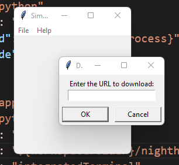

# Night Hawk


Night Hawk is a simple Video Downloader. It is a simple GUI application that allows you to download videos. It is written in Python and uses the TkInter library. This application was written for the purpose of learning and experimenting with Python.


## Features

- Download videos from YouTube

- 
## Installation

There is a requirements.txt file that contains all the dependencies. You can install them using pip.

```
pip install -r requirements.txt
```

There is also a poetry.lock file that contains all the dependencies. You can install them using poetry.

```
poetry install
```

## Usage

## Contributing

## License

## Credits

## Authors

Anthony Leotta

## Acknowledgments

## Contact